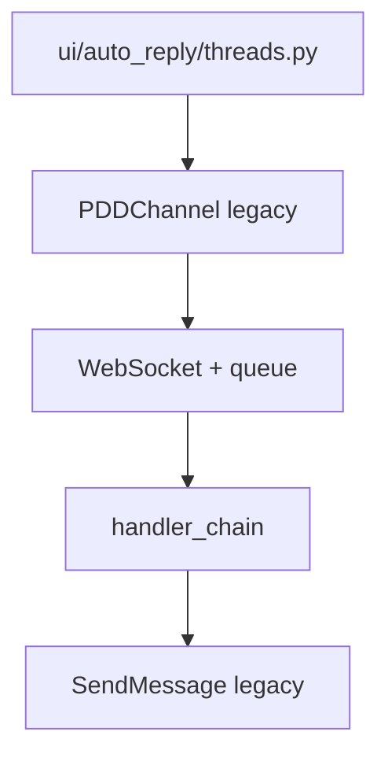
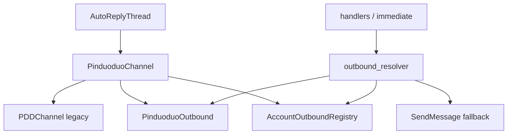

# Customer-Agent 当前架构基线（Architecture Current）

**文档导航：** [docs 目录](README.md) · [运行手册](runbook.md) · [运行模式](runtime_modes.md)

| 项 | 值 |
|---|---|
| 文档版本 | Phase **9d** 运行时 / **10a–10e** 多平台 SSOT / **10b** UI / **10d** 契约测试 |
| Checkpoint | [release_checkpoint_phase9.md](release_checkpoint_phase9.md) · [phase10_account_model.md](phase10_account_model.md) · [phase10c_plan.md](phase10c_plan.md) |
| 项目路径 | `D:\agent`（本地开发根目录示例） |
| 上游 | 基于 [JC0v0/Customer-Agent](https://github.com/JC0v0/Customer-Agent) 二次开发 |
| 状态 | **拼多多单平台深化中**；多平台骨架已铺，未接淘宝/抖店/京东运行时 |

---

## 1. 当前项目目标

Customer-Agent 正在改造为**多平台电商 AI 客服工作台**，服务对象是普通电商商家，长期目标是可交付的软件产品，而不是让商家自行部署源码。

| 维度 | 当前状态 |
|------|----------|
| **第一平台** | 拼多多（Pinduoduo），WebSocket 收消息 + MMS API 出站 |
| **后续平台** | 淘宝、抖店（DouDian）、京东等（`Channel/base` 已预留 `PlatformType`） |
| **产品形态** | **本地 GUI（PyQt6）+ 本地运行**；`config.json` 配 LLM，SQLite 存账号/关键词 |
| **非目标（当前阶段）** | 完整 SaaS、多租户云端、商家自助注册、无头批量部署控制台 |

架构策略：**Strangler Fig** — 新抽象层（`Channel/base`、`PinduoduoOutbound`、`PinduoduoChannel`）包裹 legacy `PDDChannel`，默认关闭 feature flag，保证与原项目行为兼容。

---

## 2. 阶段完成情况（Phase 0 → 6b）

| Phase | 范围 | 状态 | 要点 |
|-------|------|------|------|
| **0** | 审计 / 环境 / GUI | ✅ | clone、依赖、Playwright、四主页面、`docs/phase0_audit.md`、`docs/runbook.md` |
| **1** | `Channel/base/*` | ✅ | `PlatformType`、`BaseChannel`、`ChannelOutbound`、`ChannelRegistry`、Unified 模型骨架；**未接运行时** |
| **2a** | `PinduoduoOutbound` | ✅ | 包装 `SendMessage` / `ProductManager`；factory + `USE_PINDUODUO_OUTBOUND` |
| **2b** | handler 出站 | ✅ | `ai_handler` / `keyword_handler` outbound-first + legacy fallback |
| **2c** | 即时消息出站 | ✅ | `pdd_message_handler` 撤回/转接「[玫瑰]」outbound-first |
| **3a** | `PinduoduoChannel` | ✅ | `BaseChannel` 包装 legacy `PDDChannel` |
| **3b** | UI 运行时切换 | ✅ | `AutoReplyThread` 经 `USE_PINDUODUO_CHANNEL_WRAPPER` 选 wrapper |
| **4a** | resolver 增强 | ✅ | `metadata["outbound"]` + `AccountOutboundRegistry` + create fallback |
| **4b** | registry 生命周期 | ✅ | `PinduoduoChannel` start 注册 / stop 注销 outbound |
| **5a** | 运行模式文档 | ✅ | `docs/runtime_modes.md`、`scripts/diagnose_runtime.py` |
| **5.5–5.6** | 架构基线 + 文档索引 | ✅ | `architecture_current.md`、`docs/README.md` |
| **6a** | 第二平台规划 | ✅ | `docs/phase6a_plan.md` |
| **6b** | `DemoChannel` skeleton | ✅ | `Channel/demo/*`、`PlatformType.DEMO`、Registry 双平台单测；**非生产** |
| **7a** | UnifiedMessage mapper 规划 | ✅ | `docs/phase7a_plan.md` |
| **7b** | `pdd_to_unified` mapper | ✅ | `Channel/pinduoduo/mappers/*` + fixtures |
| **7c** | UnifiedMessage shadow | ✅ | `USE_UNIFIED_MESSAGE_SHADOW`（默认 off）；旁路 log |
| **7d** | 双轨入队 | ✅ | `USE_UNIFIED_MESSAGE_DUAL_TRACK`（默认 off）；`MessageWrapper.unified_message` |
| **7e** | metadata adapter | ✅ | `Message/metadata_adapter.py`；handler **未改** |
| **7f** | extract 委托 adapter | ✅ | `get_send_context_for_extract`；`extract_pdd_send_context` 薄委托；handler **未改** |
| **7g** | metadata observability | ✅ | `Message/metadata_observability.py`；安全观测 helper |
| **7h** | handler debug 接线 | ✅ | `handle()` 入口 `log_handler_observation`；发送路径 **未改** |
| **7i** | INFO 敏感日志清理 | ✅ | `log_sanitizer`；无 content/reply 全文/完整 buyer UID |
| **7j** | UID warning/debug 清理 | ✅ | account/buyer/cs UID 脱敏；`shop_id` 明文；发送/resolver **未改** |
| **8a** | Demo runtime spike | ✅ | Demo 入站 → 双轨入队 → Consumer → handler(Context)；**仅测试** |
| **8b** | unified outbound resolver | ✅ | `resolve_outbound` + `channel_outbound_registry` |
| **8c** | handler 接入 unified resolver | ✅ | `USE_UNIFIED_OUTBOUND_RESOLVER` 默认 off |
| **8d** | runtime diagnostics | ✅ | `runtime_capabilities` + `diagnose_runtime` capability report |
| **8e** | runtime bootstrap | ✅ | `runtime_bootstrap`；只 register |
| **8f** | app startup bootstrap | ✅ | `apply_app_startup_bootstrap()` in `app.py` `main()` |
| **9a** | AutoReply registry gated create | ✅ | 9d 起默认 on |
| **9b** | PDD registry factory parity | ✅ | `create_pinduoduo_registry_channel` |
| **9c** | Registry path parity tests | ✅ | 9d 前灰度准备 |
| **9d** | AutoReply Registry default-on | ✅ | unset → `ChannelRegistry.create`；`false` 回滚 |
| **9e** | Release checkpoint (docs) | ✅ | [release_checkpoint_phase9.md](release_checkpoint_phase9.md) |
| **10a** | Multi-platform account model (docs) | ✅ | [phase10_account_model.md](phase10_account_model.md) |
| **10b** | AutoReply UI skeleton | ✅ | [phase10b_done.md](phase10b_done.md) |
| **10c** | routing / content_type / platform SSOT (docs) | ✅ | [phase10c_done.md](phase10c_done.md) |
| **10d** | routing / platform 契约测试 | ✅ | [phase10d_done.md](phase10d_done.md) |
| **10e** | queue naming / Consumer 边界 (docs) | ✅ | [phase10e_done.md](phase10e_done.md) |
| **10f** | `build_queue_name` helper + tests | ✅ | [phase10f_done.md](phase10f_done.md) |
| **10g** | `pdd_queue_name` + legacy parity (Route B) | ✅ | [phase10g_done.md](phase10g_done.md) |
| **10h** | lifecycle Route C：`pdd_lifecycle` + lifecycle-safe wrapper | ✅ | [phase10h_done.md](phase10h_done.md) |
| **10i** | multi-platform capability matrix + spike boundary (docs) | ✅ | [phase10i_done.md](phase10i_done.md) |
| **10j** | doudian second-platform spike plan (docs) | ✅ | [phase10j_done.md](phase10j_done.md) |
| **10k** | doudian fixture + mapper contract tests | ✅ | [phase10k_done.md](phase10k_done.md) |
| **10l** | doudian mock transport + enqueue runtime flow | ✅ | [phase10l_done.md](phase10l_done.md) |
| **10m** | doudian mock outbound | ✅ | [phase10m_done.md](phase10m_done.md) |
| **11a** | Doudian registry/factory boundary (docs) | ✅ | [phase11a_done.md](phase11a_done.md) |
| **11b** | Doudian flag-gated ChannelRegistry registration | ✅ | [phase11b_done.md](phase11b_done.md) |
| **11c** | Doudian outbound resolver contract tests | ✅ | [phase11c_done.md](phase11c_done.md) |
| **11d** | Doudian channel outbound auto-registration (docs) | ✅ | [phase11d_done.md](phase11d_done.md) |
| **11e** | DoudianMockChannel outbound auto-registration | ✅ | [phase11e_done.md](phase11e_done.md) |
| **11f** | Handler unified outbound path (docs) | ✅ | [phase11f_done.md](phase11f_done.md) |
| **11g** | Doudian handler unified outbound path tests | ✅ | [phase11g_done.md](phase11g_done.md) |
| **11h** | Doudian mock spike gate review (docs) | ✅ | [phase11h_done.md](phase11h_done.md) |
| **12a** | Merchant UX + binding + safety + MVP/pricing (docs) | ✅ | [phase12a_done.md](phase12a_done.md) |
| **12b** | SaaS data model + state machines (docs) | ✅ | [phase12b_done.md](phase12b_done.md) |
| **12b.1** | Consultation-only scope alignment (docs) | ✅ | [phase12b1_done.md](phase12b1_done.md) |
| **12c** | Intent gate + send decision + preview dry-run design (docs) | ✅ | [phase12c_done.md](phase12c_done.md) |
| **12d** | Dashboard IA + read model + API contract (docs) | ✅ | [phase12d_done.md](phase12d_done.md) |
| **12e** | DB migration planning — product gate schema (docs) | ✅ | [phase12e_done.md](phase12e_done.md) |
| **12f** | Preview send gate implementation plan (docs) | ✅ | [phase12f_done.md](phase12f_done.md) |
| **13a** | Product gate pure functions + unit tests | ✅ | [phase13a_done.md](phase13a_done.md) |
| **13b** | Shadow SendDecision logging (observe-only) | ✅ | [phase13b_done.md](phase13b_done.md) |
| **13c** | Single test shop preview gate planning (docs) | ✅ | [phase13c_done.md](phase13c_done.md) |
| **13d** | Single test shop preview gate implementation (zero-send) | ✅ | [phase13d_done.md](phase13d_done.md) |
| **13e** | Preview ReplyLog projection + dashboard read model bridge | ✅ | [phase13e_done.md](phase13e_done.md) |
| **13f** | Assisted mode planning (docs) | ✅ | [phase13f_done.md](phase13f_done.md) |
| **14a** | Shadow DB schema planning (docs) | ✅ | [phase14a_done.md](phase14a_done.md) |
| **14b** | Alembic / SQL migration draft (docs) | ✅ | [phase14b_done.md](phase14b_done.md) |
| **14c** | Empty shadow migration skeleton (investigation) | ✅ | [phase14c_done.md](phase14c_done.md) |
| **14d** | Persistence architecture decision review (docs) | ✅ | [phase14d_done.md](phase14d_done.md) |
| **14e** | SaaS shadow persistence module boundary (docs) | ✅ | [phase14e_done.md](phase14e_done.md) |
| **14f** | Empty product_persistence skeleton (no DB) | ✅ | [phase14f_done.md](phase14f_done.md) |
| **14g** | Preview ReplyLog service in-memory adapter | ✅ | [phase14g_done.md](phase14g_done.md) |
| **14h** | Preview ReplyLog service integration planning (docs) | ✅ | [phase14h_done.md](phase14h_done.md) |
| **14i** | PreviewReplyLogService handler integration (test shop only) | ✅ | [phase14i_done.md](phase14i_done.md) |
| **14j** | SQLite shadow write planning (docs) | ✅ | [phase14j_done.md](phase14j_done.md) |
| **14k** | Dashboard read API planning (docs) | ✅ | [phase14k_done.md](phase14k_done.md) |
| **14l** | SQLite ReplyLog shadow write behind flags | ✅ | [phase14l_done.md](phase14l_done.md) |
| **14m** | SendDecision snapshot shadow write planning (docs) | ✅ | [phase14m_done.md](phase14m_done.md) |
| **14n** | SendDecision snapshot SQLite shadow write behind flags | ✅ | [phase14n_done.md](phase14n_done.md) |
| **14o** | Dashboard read API skeleton only | ✅ | [phase14o_done.md](phase14o_done.md) |
| **14p** | AuditLog / PendingAssisted planning (docs) | ✅ | [phase14p_done.md](phase14p_done.md) |
| **14q** | PendingAssisted + AuditLog schema behind flags | ✅ | [phase14q_done.md](phase14q_done.md) |
| **14r** | Assisted approve/reject service planning (docs) | ✅ | [phase14r_done.md](phase14r_done.md) |
| **14s** | Merchant Safety Policy + Template planning (docs) | ✅ | [phase14s_done.md](phase14s_done.md) |
| **14t** | Final Guard + Merchant Policy integration planning (docs) | ✅ | [phase14t_done.md](phase14t_done.md) |
| **14u** | MerchantSafetyPolicy + MerchantReplyTemplate schema behind flags | ✅ | [phase14u_done.md](phase14u_done.md) |
| **14v** | Final Guard pure function | ✅ | [phase14v_done.md](phase14v_done.md) |
| **14w** | Policy/template validation service skeleton | ✅ | [phase14w_done.md](phase14w_done.md) |
| **14x** | AssistedReplyService skeleton behind flags | ✅ | [phase14x_done.md](phase14x_done.md) |
| **14y** | Final Guard + Assisted service integration planning (docs) | ✅ | [phase14y_done.md](phase14y_done.md) |
| **14z** | PendingAssisted dashboard read planning (docs) | ✅ | [phase14z_done.md](phase14z_done.md) |
| **15a** | Assisted send implementation planning (docs) | ✅ | [phase15a_done.md](phase15a_done.md) |
| **15b** | Outbound idempotency skeleton behind flags | ✅ | [phase15b_done.md](phase15b_done.md) |
| **15c** | Assisted outbound dry-run port skeleton | ✅ | [phase15c_done.md](phase15c_done.md) |
| **15d** | PendingAssisted dashboard read API skeleton | ✅ | [phase15d_done.md](phase15d_done.md) |

**未纳入本表、已暂缓：** Phase 4c（consumer 将 outbound 镜像到 `metadata`）、Phase 5b（统一 bool 解析模块）。

---

## 2b. Productization Track（Phase 12a+）

与 **Engineering Track**（Channel / handler / registry / mock spike）**并行**。

| 轨道 | 目标 | 当前状态 |
|------|------|----------|
| **Engineering** | 多平台架构、PDD 生产稳定、Doudian mock 契约 | PDD ✅；Doudian mock ✅；非 production |
| **Productization** | 商家 SaaS + product gate + **PreviewReplyLogService** | **14l–15d** · dry-run port ✅ · PendingAssisted read API ✅ · live send **未实现** |

**售卖主线（12b.1 SSOT）：** **拼多多售前咨询 AI 副驾驶** — 处理商品/规格/库存等低风险咨询；**退款 / 投诉 / 售后纠纷 / 订单修改默认转人工**；先 Preview，再显式开启 Auto；平台托管 AI。

**产品边界（12b.1）：** 非「通用 PDD 自动客服」；生产代码尚未 intent gate — 见 [phase12b1_consultation_only_scope.md](phase12b1_consultation_only_scope.md)。

**技术设计（12c · implementation 未开始）：**

| 文档 | 内容 |
|------|------|
| [phase12c_intent_gate_design.md](phase12c_intent_gate_design.md) | Intent gate 管线 |
| [phase12c_send_decision_model.md](phase12c_send_decision_model.md) | SendDecision SSOT |
| [phase12c_preview_dry_run_technical_design.md](phase12c_preview_dry_run_technical_design.md) | Preview 零 send |
| [phase12c_handler_integration_plan.md](phase12c_handler_integration_plan.md) | Handler A/B/C 插入点 |
| [phase12c_test_plan.md](phase12c_test_plan.md) | T1–T10 测试计划 |

**Dashboard（12d · implementation 未开始）：**

| 文档 | 内容 |
|------|------|
| [phase12d_dashboard_ia.md](phase12d_dashboard_ia.md) | 模块 A–H IA |
| [phase12d_connection_status_read_model.md](phase12d_connection_status_read_model.md) | effective_status |
| [phase12d_reply_activity_read_model.md](phase12d_reply_activity_read_model.md) | 活动 / 队列 / 日志 |
| [phase12d_exception_and_alert_model.md](phase12d_exception_and_alert_model.md) | Alert 模型 |
| [phase12d_api_contract.md](phase12d_api_contract.md) | REST 草案 |

**DB migration（12e · implementation 未开始）：**

| 文档 | 内容 |
|------|------|
| [phase12e_db_migration_plan.md](phase12e_db_migration_plan.md) | Shadow-first 总览 |
| [phase12e_legacy_mapping.md](phase12e_legacy_mapping.md) | Legacy → SaaS |
| [phase12e_product_gate_tables.md](phase12e_product_gate_tables.md) | 核心表规划 |
| [phase12e_send_decision_reply_log_schema.md](phase12e_send_decision_reply_log_schema.md) | SendDecision / ReplyLog |
| [phase12e_migration_sequence.md](phase12e_migration_sequence.md) | M0–M9 |

**Product gate 代码（13a–13b）：**

| 模块 | 路径 |
|------|------|
| Intent / decision / guarded eval | `Message/gates/` |
| Shadow logging（observe-only） | `Message/gates/shadow_decision_logger.py` |
| Test shop config / preview log | `product_gate_config.py` · `preview_log.py` · `reply_log_projection.py` |
| AI handler hooks | `_try_shadow_log_send_decision` · `_handle_preview_product_gate` |
| 单元测试 | `tests/test_product_gate_*.py` · `tests/test_handler_*preview*` |

**product gate enforcement：** 仅 **allowlisted test shop preview**（zero-send）；**assisted/auto send 未实现**；**product persistence skeleton**（`product_persistence/` · flags 默认 off · 无 DB）。

**Product persistence（14f/14g）：**

| 路径 | 状态 |
|------|------|
| `product_persistence/flags.py` | 默认 false |
| `product_persistence/db_manager.py` | lazy init · `create_all` when flags on |
| `product_persistence/repositories/` | Protocol + **ReplyLogRepositorySQLite（14l）** |
| `PreviewReplyLogService` | in-memory + ReplyLog SQLite（14l）+ SendDecision snapshot SQLite（14n）· assisted/auto **未实现** |

**SendDecision snapshot shadow write（14n · implemented）：**

| 组件 | 状态 |
|------|------|
| `SendDecisionSnapshotRow` | ✅ ORM |
| `SendDecisionRepositorySQLite` | ✅ append-only · `ai_preview` |
| flags | `WRITE_SEND_DECISION` 默认 off |
| ReplyLog 前置 | snapshot 仅 ReplyLog SQLite 成功后写入 |

**SendDecision snapshot shadow write（14m · planning-only）：**

| 文档 | 内容 |
|------|------|
| [phase14m_senddecision_snapshot_plan.md](phase14m_senddecision_snapshot_plan.md) | 总体规划 · append-only |
| [phase14m_senddecision_schema_detail.md](phase14m_senddecision_schema_detail.md) | `send_decision_snapshots` schema |
| [phase14m_snapshot_write_flow.md](phase14m_snapshot_write_flow.md) | write flow · flags |
| [phase14m_dashboard_detail_decision_view.md](phase14m_dashboard_detail_decision_view.md) | Dashboard 决策链 |
| [phase14m_failure_and_rollback.md](phase14m_failure_and_rollback.md) | failure · rollback |
| [phase14m_test_plan.md](phase14m_test_plan.md) | M1–M10 |

**Dashboard read API（14o · skeleton implemented · 14z pending-assisted planned）：**

| 组件 | 状态 |
|------|------|
| `DashboardReadService` | ✅ list + detail · read-only |
| `api_read_routes.py` | ✅ GET reply-logs skeleton |
| PendingAssisted list/detail read | ✅ **15d** read API skeleton · no mutation |
| approve/reject/send on Dashboard | ❌ **未实现** |
| default source | `in_memory` |
| SQLite read | `READ_DASHBOARD` flag · fallback + warning |
| auth | placeholder only |

**AuditLog / PendingAssisted（14q · schema implemented）：**

| 组件 | 状态 |
|------|------|
| `PendingAssistedReplyRow` | ✅ ORM + indexes |
| `AuditLogRow` | ✅ ORM + indexes · append-only |
| `PendingAssistedRepositorySQLite` | ✅ create/get/list/mark_status · **no send** |
| `AuditLogRepositorySQLite` | ✅ append/list/get · **no update/delete** |
| approve/reject service | ✅ **14x** skeleton · assisted send **未实现** |
| auto send | ❌ **未实现** |

**AssistedReplyService（14r · planning · 14x · skeleton implemented）：**

| 组件 | 状态 |
|------|------|
| `AssistedReplyService` | ✅ skeleton behind flags |
| `create_pending_from_preview` | ✅ PendingAssisted + audit · no send |
| `approve_pending` | ✅ role + final guard only · **no send** · status not sent |
| `reject_pending` / `expire_pending` | ✅ status + audit · no send |
| handler / outbound integration | 📋 **14y** planned · **未接** |
| assisted send | ❌ **未实现** · **15a** planned |
| auto send | ❌ **未实现** |
| audit + snapshot sequence | 📋 [phase14y_audit_snapshot_ordering.md](phase14y_audit_snapshot_ordering.md) |
| state machine + idempotency | ✅ **15b** skeleton · 📋 [phase14y_idempotency_and_state_transition.md](phase14y_idempotency_and_state_transition.md) |
| approve → outbound sequence | 📋 [phase14y_approve_to_outbound_sequence.md](phase14y_approve_to_outbound_sequence.md) |
| failure + recovery | 📋 [phase14y_failure_and_recovery_policy.md](phase14y_failure_and_recovery_policy.md) |

| 文档 | 内容 |
|------|------|
| [phase14r_assisted_service_plan.md](phase14r_assisted_service_plan.md) | 总体规划 |
| [phase14r_create_pending_flow.md](phase14r_create_pending_flow.md) | create pending |
| [phase14r_approve_reject_service_flow.md](phase14r_approve_reject_service_flow.md) | approve/reject/expire |
| [phase14r_failure_and_rollback.md](phase14r_failure_and_rollback.md) | failure · rollback |
| [phase14r_test_plan.md](phase14r_test_plan.md) | R1–R15 |
| [phase14x_done.md](phase14x_done.md) | Assisted service skeleton |
| [phase14y_done.md](phase14y_done.md) | Final Guard + Assisted integration planning |

**Final Guard + Assisted Integration（14y · planning-only）：**

| 组件 | 状态 |
|------|------|
| approve → outbound sequence | 📋 documented · **not implemented** |
| audit/snapshot/idempotency ordering | 📋 documented |
| idempotency / state machine | 📋 documented |
| failure + recovery policy | 📋 documented |
| assisted send | ❌ **未实现** |
| handler / SendMessage integration | ❌ **未接** |

| 文档 | 内容 |
|------|------|
| [phase14y_final_guard_assisted_integration_plan.md](phase14y_final_guard_assisted_integration_plan.md) | 总体规划 |
| [phase14y_approve_to_outbound_sequence.md](phase14y_approve_to_outbound_sequence.md) | approve 顺序 |
| [phase14y_idempotency_and_state_transition.md](phase14y_idempotency_and_state_transition.md) | 幂等 · 状态 |
| [phase14y_audit_snapshot_ordering.md](phase14y_audit_snapshot_ordering.md) | audit · snapshot |
| [phase14y_failure_and_recovery_policy.md](phase14y_failure_and_recovery_policy.md) | 失败策略 |
| [phase14y_test_plan.md](phase14y_test_plan.md) | Y1–Y17 |

**PendingAssisted Dashboard Read（14z · planning-only）：**

| 组件 | 状态 |
|------|------|
| List GET `/api/product/pending-assisted` | 📋 contract only |
| Detail GET `/api/product/pending-assisted/{id}` | 📋 contract only |
| audit timeline view | 📋 documented |
| filters / RBAC / pagination | 📋 documented |
| read source / failure policy | 📋 documented |
| API implementation | ✅ **15d** read-only skeleton · not in app.py |
| approve/reject/send | ❌ **未实现** |

| 文档 | 内容 |
|------|------|
| [phase14z_pending_assisted_dashboard_read_plan.md](phase14z_pending_assisted_dashboard_read_plan.md) | 总体规划 |
| [phase14z_pending_list_api_contract.md](phase14z_pending_list_api_contract.md) | List API |
| [phase14z_pending_detail_api_contract.md](phase14z_pending_detail_api_contract.md) | Detail API |
| [phase14z_audit_timeline_view.md](phase14z_audit_timeline_view.md) | Timeline |
| [phase14z_filters_permissions_and_pagination.md](phase14z_filters_permissions_and_pagination.md) | 权限 · 分页 |
| [phase14z_read_source_and_failure_policy.md](phase14z_read_source_and_failure_policy.md) | 数据源 · 失败 |
| [phase14z_test_plan.md](phase14z_test_plan.md) | Z1–Z17 |
| [phase14z_done.md](phase14z_done.md) | 签收 |

**Assisted Send Implementation（15a · planning-only）：**

| 组件 | 状态 |
|------|------|
| approve → live outbound | 📋 documented · **not implemented** |
| AssistedOutboundPort contract | ✅ **15c** dry-run skeleton · live **未实现** |
| idempotency lock contract | ✅ **15b** skeleton · no send integration |
| dry-run / test shop rollout | ✅ dry-run port · live **未实现** |
| assisted send | ❌ **未实现** |
| auto send | ❌ **未实现** |
| handler / SendMessage direct call | ❌ **禁止** |

| 文档 | 内容 |
|------|------|
| [phase15a_assisted_send_implementation_plan.md](phase15a_assisted_send_implementation_plan.md) | 总体规划 |
| [phase15a_outbound_contract.md](phase15a_outbound_contract.md) | Outbound port |
| [phase15a_idempotency_lock_contract.md](phase15a_idempotency_lock_contract.md) | 幂等锁 |
| [phase15a_status_transition_and_audit.md](phase15a_status_transition_and_audit.md) | 状态 · audit |
| [phase15a_single_test_shop_rollout.md](phase15a_single_test_shop_rollout.md) | 灰度 |
| [phase15a_failure_rollback_policy.md](phase15a_failure_rollback_policy.md) | 失败 · rollback |
| [phase15a_test_plan.md](phase15a_test_plan.md) | A1–A21 |
| [phase15a_done.md](phase15a_done.md) | 签收 |

**Outbound Idempotency（15b · skeleton implemented）：**

| 组件 | 状态 |
|------|------|
| `OutboundIdempotencyRow` ORM | ✅ behind flags |
| `OutboundIdempotencyRepositorySQLite` | ✅ acquire / mark_succeeded / mark_failed |
| assisted send integration | ❌ **未接** |
| handler / SendMessage / outbound | ❌ **未调用** |
| PDD / Doudian 热路径 | ❌ **未改** |

| 文档 | 内容 |
|------|------|
| [phase15b_done.md](phase15b_done.md) | Idempotency skeleton · no send |

**Assisted Outbound Dry-run Port（15c · skeleton implemented）：**

| 组件 | 状态 |
|------|------|
| `AssistedOutboundPort` interface | ✅ |
| `DryRunAssistedOutboundPort` | ✅ would_send only · no SendMessage |
| `AssistedReplyService` wire-in | ❌ **15f** |
| live assisted send | ❌ **未实现** |
| handler / PDD / Doudian | ❌ **未改** |

| 文档 | 内容 |
|------|------|
| [phase15c_done.md](phase15c_done.md) | Dry-run port · no send |

**PendingAssisted Dashboard Read API（15d · skeleton implemented）：**

| 组件 | 状态 |
|------|------|
| `PendingAssistedDashboardReadService` | ✅ list/detail read-only |
| `pending_assisted_api_read_routes` | ✅ GET skeleton · **not registered in app.py** |
| approve / reject / send endpoints | ❌ **未实现** |
| final guard on read | ❌ **不执行** · reads audit history |
| audit write on read | ❌ **无** |
| handler / outbound / SendMessage | ❌ **未调用** |

| 文档 | 内容 |
|------|------|
| [phase15d_done.md](phase15d_done.md) | Read API skeleton · no mutation |

**Merchant Safety Policy + Template（14s · planning · 14u · schema implemented）：**

| 组件 | 状态 |
|------|------|
| `MerchantSafetyPolicyRow` | ✅ ORM + indexes（14u） |
| `MerchantReplyTemplateRow` | ✅ ORM + indexes（14u） |
| `MerchantPolicyRepositorySQLite` | ✅ create/get/find/list/update/disable · **no send** |
| `MerchantReplyTemplateRepositorySQLite` | ✅ create/get/list/update/disable · **no scan/send** |
| `ai_intervention_mode` 五档 | 📋 documented · stored as TEXT |
| `platform_mode_ceiling` | 📋 documented · stored as TEXT |
| effective_mode 业务逻辑 | ❌ **未实现** |
| template validation / forbidden scan | ✅ **14w** service skeleton · no DB/send |
| policy snapshot on ReplyLog/Snapshot | 📋 planned |
| final guard | ✅ **14v** pure function · **no send integration** |
| assisted / auto send | ❌ **未实现** |

| 文档 | 内容 |
|------|------|
| [phase14s_merchant_safety_policy_plan.md](phase14s_merchant_safety_policy_plan.md) | 总体规划 |
| [phase14s_intervention_modes_and_platform_ceiling.md](phase14s_intervention_modes_and_platform_ceiling.md) | mode · ceiling · 红线 |
| [phase14s_pipeline_and_precedence.md](phase14s_pipeline_and_precedence.md) | pipeline |
| [phase14s_default_policy_matrix.md](phase14s_default_policy_matrix.md) | 默认矩阵 |
| [phase14s_template_validation_and_forbidden_scan.md](phase14s_template_validation_and_forbidden_scan.md) | scan |
| [phase14s_policy_snapshot_and_audit.md](phase14s_policy_snapshot_and_audit.md) | snapshot · audit |
| [phase14s_test_plan.md](phase14s_test_plan.md) | S1–S16 |
| [phase14u_done.md](phase14u_done.md) | schema + repository skeleton |
| [phase14w_done.md](phase14w_done.md) | policy/template validation service skeleton |

**Policy / Template Validation Service（14w · skeleton implemented）：**

| 组件 | 状态 |
|------|------|
| `validate_policy_mode` | ✅ ceiling · redline · effective_mode · no DB |
| `validate_reply_template` | ✅ forbidden scan · variable whitelist · validation_status |
| `compute_content_hash` | ✅ sha256 |
| handler / final guard integration | ❌ **未接** |
| assisted / auto send | ❌ **未实现** |

**Final Guard + Merchant Policy（14t · planning · 14v · pure function implemented）：**

| 组件 | 状态 |
|------|------|
| `evaluate_final_guard` pure function | ✅ **14v** · G1–G27 · no I/O |
| `scan_forbidden_promise` | ✅ **14v** · redline text scan |
| handler / service integration | ❌ **未接** |
| G1–G27 rule matrix | ✅ implemented in pure function |
| forbidden promise scan | ✅ implemented |
| I/O contract | ✅ `FinalGuardInput` / `FinalGuardResult` |
| audit/snapshot integration | 📋 planned · caller responsibility |
| assisted / auto send | ❌ **未实现** · guard decision only |

| 文档 | 内容 |
|------|------|
| [phase14t_final_guard_policy_integration_plan.md](phase14t_final_guard_policy_integration_plan.md) | 总体规划 |
| [phase14t_guard_input_output_contract.md](phase14t_guard_input_output_contract.md) | I/O |
| [phase14t_guard_rule_matrix.md](phase14t_guard_rule_matrix.md) | G1–G27 |
| [phase14t_forbidden_promise_scan_rules.md](phase14t_forbidden_promise_scan_rules.md) | 禁诺 |
| [phase14t_template_and_ai_text_guarding.md](phase14t_template_and_ai_text_guarding.md) | 文本 guarding |
| [phase14t_audit_snapshot_integration.md](phase14t_audit_snapshot_integration.md) | audit · snapshot |
| [phase14t_failure_policy.md](phase14t_failure_policy.md) | failure |
| [phase14t_test_plan.md](phase14t_test_plan.md) | T1–T25 |

**AuditLog / PendingAssisted（14p · planning-only）：**

| 组件 | 状态 |
|------|------|
| `pending_assisted_replies` | 📋 schema planned · **未建表** |
| `audit_logs` | 📋 schema planned · **未建表** |
| approve/reject flow | 📋 planned · **未实现** |
| final guard (assisted send) | 📋 planned · **未实现** |
| assisted / auto send | ❌ **未实现** |

| 文档 | 内容 |
|------|------|
| [phase14p_auditlog_pending_assisted_plan.md](phase14p_auditlog_pending_assisted_plan.md) | 总体规划 |
| [phase14p_pending_assisted_schema_detail.md](phase14p_pending_assisted_schema_detail.md) | pending schema |
| [phase14p_auditlog_schema_detail.md](phase14p_auditlog_schema_detail.md) | audit schema |
| [phase14p_assisted_approve_reject_flow.md](phase14p_assisted_approve_reject_flow.md) | approve/reject/expire |
| [phase14p_permissions_and_final_guard.md](phase14p_permissions_and_final_guard.md) | 角色 · final guard |
| [phase14p_failure_and_rollback.md](phase14p_failure_and_rollback.md) | failure · rollback |
| [phase14p_test_plan.md](phase14p_test_plan.md) | P1–P14 |

**Dashboard read API（14k · planning-only）：**

| 文档 | 内容 |
|------|------|
| [phase14k_dashboard_read_api_plan.md](phase14k_dashboard_read_api_plan.md) | 总体规划 · 只读 |
| [phase14k_replylog_list_api_contract.md](phase14k_replylog_list_api_contract.md) | `GET /api/product/reply-logs` |
| [phase14k_replylog_detail_api_contract.md](phase14k_replylog_detail_api_contract.md) | detail contract |
| [phase14k_dashboard_filters_and_permissions.md](phase14k_dashboard_filters_and_permissions.md) | 筛选 · 权限 |
| [phase14k_read_source_strategy.md](phase14k_read_source_strategy.md) | in-memory ↔ SQLite read |
| [phase14k_test_plan.md](phase14k_test_plan.md) | D1–D11 |

**SQLite shadow write（14j · planning-only）：**

| 文档 | 内容 |
|------|------|
| [phase14j_sqlite_shadow_write_plan.md](phase14j_sqlite_shadow_write_plan.md) | 总体方案 · in-memory first |
| [phase14j_product_gate_db_schema_plan.md](phase14j_product_gate_db_schema_plan.md) | `reply_logs` 最小 schema |
| [phase14j_replylog_shadow_write_flow.md](phase14j_replylog_shadow_write_flow.md) | write flow · DB failure policy |
| [phase14j_flags_failure_rollback.md](phase14j_flags_failure_rollback.md) | flags · rollback |
| [phase14j_test_plan.md](phase14j_test_plan.md) | S1–S10 |

**Preview ReplyLog service integration（14h · planning-only）：**

| 文档 | 内容 |
|------|------|
| [phase14h_preview_service_integration_plan.md](phase14h_preview_service_integration_plan.md) | as-is / to-be · 迁移步骤 |
| [phase14h_handler_boundary_plan.md](phase14h_handler_boundary_plan.md) | handler ↔ service 边界 |
| [phase14h_zero_send_regression_plan.md](phase14h_zero_send_regression_plan.md) | H1–H10 回归 |
| [phase14h_failure_policy.md](phase14h_failure_policy.md) | fail-safe · no-send on failure |

**Product persistence boundary（14e · planning-only）：**

| 文档 | 内容 |
|------|------|
| [phase14e_product_persistence_boundary.md](phase14e_product_persistence_boundary.md) | 目录 · 隔离 |
| [phase14e_product_db_manager_design.md](phase14e_product_db_manager_design.md) | ProductDbManager |
| [phase14e_repository_interfaces.md](phase14e_repository_interfaces.md) | Repository Protocol |
| [phase14e_flags_and_failure_policy.md](phase14e_flags_and_failure_policy.md) | Flags · fail policy |
| [phase14e_integration_points.md](phase14e_integration_points.md) | Handler → Service |

**Shadow DB schema（14a · planning-only）：**

| 文档 | 内容 |
|------|------|
| [phase14a_shadow_db_schema_plan.md](phase14a_shadow_db_schema_plan.md) | 总目标 · shadow-first |
| [phase14a_replylog_schema.md](phase14a_replylog_schema.md) | ReplyLog |
| [phase14a_pending_assisted_reply_schema.md](phase14a_pending_assisted_reply_schema.md) | PendingAssistedReply |
| [phase14a_auditlog_schema.md](phase14a_auditlog_schema.md) | AuditLog |
| [phase14a_senddecision_schema.md](phase14a_senddecision_schema.md) | SendDecision snapshot |
| [phase14a_migration_sequence.md](phase14a_migration_sequence.md) | M0–M9 |

**Migration DDL draft（14b · draft-only）：**

| 文档 | 内容 |
|------|------|
| [phase14b_migration_draft_overview.md](phase14b_migration_draft_overview.md) | 命名 · shadow-first |
| [phase14b_reply_logs_migration_draft.md](phase14b_reply_logs_migration_draft.md) | `reply_logs` SQL |
| [phase14b_send_decision_snapshots_migration_draft.md](phase14b_send_decision_snapshots_migration_draft.md) | snapshots SQL |
| [phase14b_pending_assisted_replies_migration_draft.md](phase14b_pending_assisted_replies_migration_draft.md) | pending SQL |
| [phase14b_audit_logs_migration_draft.md](phase14b_audit_logs_migration_draft.md) | audit SQL |
| [phase14b_indexes_constraints_rollback.md](phase14b_indexes_constraints_rollback.md) | rollback SSOT |

**Assisted mode（13f · planning-only）：**

| 文档 | 内容 |
|------|------|
| [phase13f_assisted_mode_plan.md](phase13f_assisted_mode_plan.md) | 模式对比 · 原则 |
| [phase13f_assisted_confirmation_flow.md](phase13f_assisted_confirmation_flow.md) | AI vs 商家确认 |
| [phase13f_auditlog_and_permissions.md](phase13f_auditlog_and_permissions.md) | 角色 · AuditLog |
| [phase13f_risk_controls.md](phase13f_risk_controls.md) | blocked · 禁诺 · stale |
| [phase13f_assisted_test_plan.md](phase13f_assisted_test_plan.md) | A1–A12 |

**Single test shop preview gate（13c · planning-only）：**

| 文档 | 内容 |
|------|------|
| [phase13c_single_test_shop_preview_plan.md](phase13c_single_test_shop_preview_plan.md) | 总目标 · 不变量 |
| [phase13c_test_shop_gate_selection.md](phase13c_test_shop_gate_selection.md) | allowlist · 选型 |
| [phase13c_preview_integration_flow.md](phase13c_preview_integration_flow.md) | handler flow |
| [phase13c_zero_send_test_plan.md](phase13c_zero_send_test_plan.md) | Z1–Z10 |
| [phase13c_rollback_and_safety.md](phase13c_rollback_and_safety.md) | Go/No-Go · 回滚 |

**Preview send gate 设计（12f）：**

| 文档 | 内容 |
|------|------|
| [phase12f_preview_send_gate_plan.md](phase12f_preview_send_gate_plan.md) | 总计划 · 不变量 |
| [phase12f_guarded_send_design.md](phase12f_guarded_send_design.md) | `send_text_guarded` |
| [phase12f_intent_classifier_plan.md](phase12f_intent_classifier_plan.md) | 两层 classifier |
| [phase12f_handler_integration_steps.md](phase12f_handler_integration_steps.md) | H0–H6 |
| [phase12f_test_implementation_plan.md](phase12f_test_implementation_plan.md) | T1–T12 |

**产品化文档索引：**

| 文档 | 内容 |
|------|------|
| [phase12a_merchant_onboarding_ux.md](phase12a_merchant_onboarding_ux.md) | Onboarding 全流程 |
| [phase12a_shop_binding_playbook.md](phase12a_shop_binding_playbook.md) | 四平台绑定方式 |
| [phase12a_safety_and_preview_spec.md](phase12a_safety_and_preview_spec.md) | Preview / Assisted / Auto |
| [phase12a_ai_provider_and_billing_model.md](phase12a_ai_provider_and_billing_model.md) | 平台托管 AI |
| [phase12a_mvp_scope_and_pricing.md](phase12a_mvp_scope_and_pricing.md) | MVP + 三档套餐 |
| [phase12b1_consultation_only_scope.md](phase12b1_consultation_only_scope.md) | Consultation-only 三表（allow/block/uncertain） |
| [phase12b1_intent_boundary.md](phase12b1_intent_boundary.md) | Intent 管线与优先级 |
| [phase12b1_send_gate_requirements.md](phase12b1_send_gate_requirements.md) | Send gate 验收字段 |
| [phase12b1_product_messaging_update.md](phase12b1_product_messaging_update.md) | 对外话术 |

**数据模型（12b · implementation 未开始）：**

| 文档 | 内容 |
|------|------|
| [phase12b_data_model_plan.md](phase12b_data_model_plan.md) | SaaS 对象总览 |
| [phase12b_merchant_workspace_model.md](phase12b_merchant_workspace_model.md) | Merchant / Workspace / Member |
| [phase12b_shop_binding_state_model.md](phase12b_shop_binding_state_model.md) | ShopBinding 状态机 |
| [phase12b_credential_security_model.md](phase12b_credential_security_model.md) | CredentialRef |
| [phase12b_reply_mode_and_control_model.md](phase12b_reply_mode_and_control_model.md) | ReplyMode / Safety |
| [phase12b_plan_usage_model.md](phase12b_plan_usage_model.md) | Plan / Usage |

**下一产品化 Phase：** **14h** handler integration planning · **14i** SQLite shadow write planning · **14j** Dashboard API · **12g** wireframe。

---

## 3. 默认运行链路（生产兼容）

### Feature flags（默认）

```text
USE_CHANNEL_REGISTRY_FOR_AUTOREPLY=true   # 未设置 → true（9d）
USE_PINDUODUO_CHANNEL_WRAPPER=false     # 未设置 → false
USE_PINDUODUO_OUTBOUND=false            # 未设置 → false
```

### 端到端路径

```text
用户 GUI（自动回复页）
  → ui/auto_reply/manager.py
  → ui/auto_reply/threads.py :: AutoReplyThread
       → create_auto_reply_runtime_channel()
            → ChannelRegistry.create(PINDUODUO)   # 9d 默认（app 已 bootstrap）
            → create_pinduoduo_registry_channel()
            → _create_auto_reply_legacy()
       → PDDChannel()（wrapper 默认 off）或 PinduoduoChannel（wrapper on）
       → LifecycleMixin.start_account
            → init → WebSocket 连接
            → _setup_message_consumer → handler_chain
       → MessageHandlerMixin._message_loop
            → PDDChatMessage → Context
            → 入队 put_message 或 即时 _handle_immediate_message
  → MessageConsumer._process_message
       → metadata（shop_id / user_id / from_uid）
       → KeywordDetectionHandler → AIReplyHandler → …
  → 出站：SendMessage.send_text / move_conversation（同步 API）
```

**含义：** 默认仍为 **PDDChannel + SendMessage**（与 Phase 0 一致）；9d 仅 Channel **创建** 经 Registry 分发（9b parity）。详见 [release_checkpoint_phase9.md §3](release_checkpoint_phase9.md#3-current-default-runtime-path)。



### Demo runtime 测试路径（Phase 8a，非生产）

```text
DemoChannel(inject_runtime_flow=True) 或 enqueue_demo_message
  → demo_raw_to_context + demo_raw_to_unified
  → enqueue_inbound_message（USE_UNIFIED_MESSAGE_DUAL_TRACK 可选）
  → queue demo_{shop_id}
  → MessageConsumer → handler(Context, metadata)
```

与 PDD 生产路径 **隔离**（独立 queue、不改 `pdd_message_handler` / app / UI）。

### Unified outbound 解析（Phase 8b–8c）

```text
handler _send_reply / keyword handle:
  USE_UNIFIED_OUTBOUND_RESOLVER off → resolve_pinduoduo_outbound（生产默认）
  USE_UNIFIED_OUTBOUND_RESOLVER on  → resolve_outbound
       1. metadata["outbound"]
       2. channel_outbound_registry
       3. platform==pinduoduo → resolve_pinduoduo_outbound
       4. 其它 → None

pdd_message_handler 即时消息：仍 resolve_pinduoduo_outbound（未接 8c）
```

**双 flag（PDD Context）**

| `USE_UNIFIED_OUTBOUND_RESOLVER` | `USE_PINDUODUO_OUTBOUND` | handler 出站 |
|--------------------------------|--------------------------|--------------|
| off | off | 旧 resolver → None → legacy **（默认）** |
| off | on | 旧 resolver → outbound / legacy |
| on | off | unified → 委托 → None → legacy |
| on | on | unified → 委托 → outbound / legacy |

**AccountOutboundRegistry** 与 **channel_outbound_registry** 并行；未迁移 PDD 注册。

### ChannelRegistry bootstrap（Phase 8e，与 GUI 双路径）

```text
apply_app_startup_bootstrap()  → register_default_platforms()（Phase 8f，app main()）
                               → 可选 DEMO（USE_DEMO_CHANNEL_REGISTRATION=true）
                               → 失败不阻断 GUI；不 start_account

AutoReplyThread（生产）        → create_auto_reply_runtime_channel()
diagnose_runtime               → 独立子进程，只读 status，默认不 register
```

### AutoReply 创建决策树（Phase 9a + 9b）

```text
register_pinduoduo_channel() → create_pinduoduo_registry_channel
  └─ _create_auto_reply_legacy()  # 读 USE_PINDUODUO_CHANNEL_WRAPPER

create_auto_reply_runtime_channel()
  USE_CHANNEL_REGISTRY_FOR_AUTOREPLY=false → _create_auto_reply_legacy()（回滚）
  unset 或 true（9d 默认）, 已注册        → ChannelRegistry.create(PINDUODUO)
       └─ create_pinduoduo_registry_channel → wrapper off: PDDChannel / on: PinduoduoChannel
  未注册/失败                              → warning + _create_auto_reply_legacy()
```

`create_pinduoduo_channel` 仍为 **wrapper-only** 直接工厂，不经 Registry 注册。

**Phase 9d：** 生产默认 `USE_CHANNEL_REGISTRY_FOR_AUTOREPLY` 未设置 → Registry path（app bootstrap 后）；显式 `false` 回滚 legacy；见 `test_autoreply_registry_default`。

### 多平台账号与 UI 规划（Phase 10a，仅文档）

| 项 | 说明 |
|----|------|
| 数据模型 | DB 已有 `channels.channel_name`；**即** `platform_id`（= `PlatformType.value`） |
| 账号 dict | `get_all_accounts_with_details()` → `channel_name`, `shop_id`, `user_id`, … |
| UI 展示 | 自动回复 / 账号管理页已显示平台 badge |
| **运行时** | **仍仅 PDD**：`AutoReplyThread` → `pinduoduo.channel_factory`；不按 `channel_name` 路由 |
| 10a | 无 migration、无 schema 变更、无第二平台 seed |
| SSOT | [phase10_account_model.md](phase10_account_model.md) |
| **10b（已实现）** | `platform_ui.py` + 筛选 + 非 PDD 禁用启动；**运行时仍仅 PDD** |

### routing / content_type / platform SSOT（Phase 10c，仅文档）

| 维度 | SSOT 摘要 |
|------|-----------|
| **生产入站** | `PDDChatMessage` → `Context` → queue / immediate / drop → `MessageConsumer` → handler（**Context-first**） |
| **UnifiedMessage** | 7b mapper 已有；**shadow / dual-track 默认 off** |
| **platform** | `channel_name` == `UnifiedMessage.platform.value` == `Context.channel_type.value`；缺省 → `pinduoduo` |
| **routing** | `immediate` \| `queue` \| `drop`；PDD 由 `compute_pdd_routing`；存 `conversation.extra["routing"]` |
| **content_type** | 跨平台 snake 字符串；PDD = `ContextType.value` |
| **handler** | 仍 `can_handle(Context.type)`；不以 routing 改生产默认（Route C → flag，推迟） |
| **10d（已实现）** | 契约测试锁定 SSOT：`test_pdd_routing_parity`、`test_platform_message_contract`；**生产默认未变** |
| **10e（已规划）** | queue：`pdd_{shop_id}` 保持；分工见 [phase10e_done.md](phase10e_done.md) |
| **10f（已实现）** | SSOT：[Message/queue_naming.py](../Message/queue_naming.py) |
| **10g（Route B）** | `pdd_queue_name` + parity 测试 — [phase10g_done.md](phase10g_done.md) |
| **10h（Route C）** | 生产 PDD lifecycle 经 `_lifecycle_pdd_queue_name` 使用 `pdd_queue_name`；正常 `shop_id` → `pdd_{shop_id}`；`None`/空/空白保持历史 f-string — [phase10h_done.md](phase10h_done.md) |
| **10i（docs）** | **Capability matrix SSOT** + 第二平台 spike 边界；PDD/Demo/真实平台最小 spike 表；PDD-only 路径冻结 — [phase10i_plan.md](phase10i_plan.md) |
| **10j（docs）** | **Doudian spike plan**：fixture/mapper/routing 设计、`doudian_{shop_id}`、10k–11+ 拆分；不接真实 API — [phase10j_plan.md](phase10j_plan.md) |
| **10k（spike）** | **Doudian mock mappers** + fixtures + contract tests；**非 production**（无 transport/login） — [phase10k_done.md](phase10k_done.md) |
| **10l（spike）** | **Mock transport** + `enqueue_doudian_raw_message`；drop 不入队；测试 patch 入队（无 Consumer 线程） — [phase10l_done.md](phase10l_done.md) |
| **10m（spike）** | **`DoudianMockOutbound`** — `sent_messages` 记录；测试内 registry；非 production — [phase10m_done.md](phase10m_done.md) |
| **11c（Route B）** | **`resolve_outbound`** + `channel_outbound_registry` 抖店契约测试；handler 默认仍 PDD — [phase11c_done.md](phase11c_done.md) |
| **11d（docs）** | **`DoudianMockChannel` lifecycle auto-register 规划** — [phase11d_done.md](phase11d_done.md) |
| **11e（Route C）** | **`start_account` register / `stop_account` unregister** → `channel_outbound_registry` — [phase11e_done.md](phase11e_done.md) |
| **11f（docs）** | **Handler unified outbound 测试边界** — [phase11f_done.md](phase11f_done.md) |
| **11g（Route C）** | **`test_handler_doudian_unified_outbound.py`** — handler + unified flag（仅测试）→ Doudian mock send — [phase11g_done.md](phase11g_done.md) |
| **11h（docs）** | **Mock spike 收口 + production gate G1–G12 + Phase 12 拆分** — [phase11h_done.md](phase11h_done.md) |

**Queue naming SSOT：** 生产 PDD lifecycle → `pdd_queue_name` → **`pdd_{shop_id}`**；抖店 spike（10k）测试 → **`doudian_{shop_id}`**（`build_queue_name`），**不得**占用 `pdd_` 前缀。

**Doudian mock runtime（11e）：** 仅当显式创建 `DoudianMockChannel` 并 `start_account` 时，outbound 写入 `channel_outbound_registry`；`USE_DOUDIAN_CHANNEL_REGISTRATION` 默认 **false**，bootstrap **不** 创建抖店 channel；AutoReply 仍 PDD-only。

**Handler unified outbound（11g）：** 生产 handler 默认仍 `resolve_pinduoduo_outbound`；抖店 handler 出站链 **仅** 在测试内 `USE_UNIFIED_OUTBOUND_RESOLVER=true` 验证；默认 env **不变**。

**Doudian mock spike 状态（11h）：** Phase **10k–11g 已完成、非 production**；真实 API **No-Go** until research gate。

**Productization（12a–15d）：** **15d** PendingAssisted dashboard read API skeleton（list/detail GET · flags off default · no approve/send）；**15e** live send planning 待做。

---

## 4. 新架构完整运行链路（联调目标）

### Feature flags

```text
USE_PINDUODUO_CHANNEL_WRAPPER=true
USE_PINDUODUO_OUTBOUND=true
```

### 端到端路径

```text
AutoReplyThread
  → create_auto_reply_runtime_channel()
  → PinduoduoChannel(BaseChannel)
       → 内部 _legacy: PDDChannel（WebSocket / 队列 / 解析 不变）
       → start_account 后：
            self.outbound（lazy PinduoduoOutbound）
            AccountOutboundRegistry.register(shop_id, account_id, outbound)
  → 消息处理（同 legacy 入队 / 即时路径）
  → handler / 即时消息：
       USE_UNIFIED_OUTBOUND_RESOLVER off → resolve_pinduoduo_outbound（默认）
       USE_UNIFIED_OUTBOUND_RESOLVER on  → resolve_outbound →（PDD 委托旧 resolver）
         1. metadata["outbound"]（若调用方注入）
         2. AccountOutboundRegistry.get(shop_id, user_id)  ← Phase 4b
         3. create_pinduoduo_outbound（fallback）
       → await outbound.send_text / transfer_to_human
       → 失败则 legacy SendMessage
  → stop_account：
       legacy.stop_account → registry.unregister → 清空 _outbound
```

**注意：** `request_stop()` 仅停 WebSocket **不** unregister；registry 与 `stop_account` 绑定（见 §9）。



---

## 5. 关键模块职责

### 多平台骨架

| 路径 | 职责 |
|------|------|
| **`Channel/base/`** | 跨平台契约：`PlatformType`、`ChannelStatus`、`BaseChannel`、`ChannelOutbound` Protocol、`Unified*` 模型、`ChannelRegistry` 工厂表（PDD 尚未在 app 启动时 register） |

### Demo Channel（Phase 6b，非生产）

| 路径 | 职责 |
|------|------|
| **`Channel/demo/demo_channel.py`** | 第二个 `BaseChannel`；8a：`inject_runtime_flow` 测试入队 |
| **`Channel/demo/demo_inbound.py`** | Phase 8a：Demo 入站 → `enqueue_inbound_message` |
| **`Channel/demo/mappers/*`** | Phase 8a：`demo_raw_to_context` / `demo_raw_to_unified` |
| **`Channel/demo/demo_outbound.py`** | 第二个 `ChannelOutbound`；`sent_log` + 固定 stub 数据 |
| **`Channel/demo/demo_factory.py`** | `create_demo_channel` / `register_demo_channel`（**仅测试 bootstrap**） |
| **`Message/inbound_enqueue.py`** | Phase 8a：统一入队 helper（读 `USE_UNIFIED_MESSAGE_DUAL_TRACK`） |

### 拼多多 Unified 映射（Phase 7b，未接运行时）

| 路径 | 职责 |
|------|------|
| **`Channel/pinduoduo/mappers/pdd_to_unified.py`** | `PDDChatMessage` → `UnifiedMessage`；`compute_pdd_routing` |
| **`Channel/pinduoduo/mappers/shadow.py`** | Phase 7c：shadow log；双轨 on 时跳过重复 mapper |
| **`Channel/pinduoduo/mappers/dual_track_flags.py`** | Phase 7d：`USE_UNIFIED_MESSAGE_DUAL_TRACK` |

### 拼多多 Channel / 出站

| 路径 | 职责 |
|------|------|
| **`Channel/pinduoduo/pdd_channel.py`** | Legacy 运行时：`PDDChannel` = Connection + MessageHandler + Lifecycle + Status Mixins |
| **`Channel/pinduoduo/pinduoduo_channel.py`** | `BaseChannel` 实现；委托 legacy；管理 `outbound` 与 registry 注册/注销 |
| **`Channel/pinduoduo/pinduoduo_outbound.py`** | `ChannelOutbound` 实现；`asyncio.to_thread` 包装 `SendMessage` / `ProductManager` |
| **`Channel/pinduoduo/outbound_factory.py`** | `create_pinduoduo_outbound`；`create_auto_reply_runtime_channel`；`start_auto_reply_account`（统一 start 签名） |
| **`Channel/pinduoduo/channel_flags.py`** | `use_pinduoduo_channel_wrapper()` ← `USE_PINDUODUO_CHANNEL_WRAPPER` |
| **`Channel/pinduoduo/outbound_flags.py`** | `use_pinduoduo_outbound()` ← `USE_PINDUODUO_OUTBOUND` |

### 消息 / 出站解析

| 路径 | 职责 |
|------|------|
| **`Message/models/queue_models.py`** | `MessageWrapper`：`context`（必填）+ `unified_message`（可选，Phase 7d） |
| **`Message/core/consumer.py`** | `enrich_metadata_from_unified`；handler 仍 `handle(context, metadata)` |
| **`Message/metadata_adapter.py`** | Phase 7e：统一读取 metadata/context；7f：`get_send_context_for_extract`（legacy extract 等价） |
| **`Message/log_sanitizer.py`** | Phase 7i–7j：日志脱敏（content/reply/UID refs、`format_send_context_log`） |
| **`Message/metadata_observability.py`** | Phase 7g–7h：`build_handler_observation` + `log_handler_observation`（`logger.debug`，默认 INFO 无输出） |
| **`Message/handlers/outbound_resolver.py`** | **生产**：`resolve_pinduoduo_outbound`（metadata → AccountOutboundRegistry → create） |
| **`Message/handlers/unified_outbound_resolver.py`** | Phase 8b：`resolve_outbound`；PDD 委托旧 resolver |
| **`Message/handlers/channel_outbound_registry.py`** | Phase 8b：`platform:shop_id:account_id` → `ChannelOutbound` |
| **`Message/handlers/account_outbound_registry.py`** | PDD 专用：`shop_id:user_id`（8b 未改） |
| **`Message/handlers/unified_outbound_flags.py`** | Phase 8c：`USE_UNIFIED_OUTBOUND_RESOLVER` |
| **`Message/handlers/ai_handler.py`** | AI 回复；`_send_reply` UNIFIED flag 选 resolver |
| **`Message/handlers/keyword_handler.py`** | 关键词转人工；UNIFIED flag 选 resolver |
| **`Channel/pinduoduo/core/pdd_message_handler.py`** | WS 消息路由；即时消息「[玫瑰]」outbound-first（**未改 WS 本身**） |

### UI / 运维

| 路径 | 职责 |
|------|------|
| **`ui/auto_reply/threads.py`** | 每账号一线程一 event loop；`create_auto_reply_runtime_channel` + `start_auto_reply_account`；`request_stop` |
| **`Message/runtime_capabilities.py`** | Phase 8d–8e：flag / import / capability + bootstrap 字段 |
| **`Message/runtime_bootstrap.py`** | Phase 8e：`register_default_platforms`、bootstrap status |
| **`Message/bootstrap_flags.py`** | Phase 8e：`USE_DEMO_CHANNEL_REGISTRATION` |
| **`scripts/diagnose_runtime.py`** | 无 GUI/PDD 诊断：flags、capability、Platform bootstrap |
| **`docs/runtime_modes.md`** | 运行模式 SSOT、四组合矩阵、回退说明 |

### 其它（未重构，仍为核心）

| 路径 | 职责 |
|------|------|
| `app.py` | 入口；Playwright 路径；DI |
| `Message/core/consumer.py` | 队列消费；组装 metadata |
| `Message/__init__.py` | `handler_chain`、`put_message` |
| `Agent/CustomerAgent/` | LLM Agent 工具与回复 |
| `bridge/context.py` | `Context` / `PinduoduoKwargs` |
| `config.json` | LLM API（与运行模式 flag 分离） |

---

## 6. Feature flags 与四种组合

| 变量 | 读取 | 默认 |
|------|------|------|
| `USE_PINDUODUO_CHANNEL_WRAPPER` | `channel_flags.py` → `channel_factory.create_auto_reply_runtime_channel` | **false** |
| `USE_PINDUODUO_OUTBOUND` | `outbound_flags.py` → `outbound_resolver.resolve_*` | **false** |
| `USE_UNIFIED_OUTBOUND_RESOLVER` | `unified_outbound_flags.py` → handler 选 `resolve_outbound` | **false** |
| `USE_DEMO_CHANNEL_REGISTRATION` | `bootstrap_flags.py` → `register_default_platforms` 含 Demo | **false** |
| `USE_DOUDIAN_CHANNEL_REGISTRATION` | `doudian_flags` → `register_doudian_channel`（**11b**） | **false** |

真值：`1` / `true` / `yes` / `on`（大小写不敏感）。

### 组合矩阵

| ID | Wrapper | Outbound | 模式名 | 行为 | 推荐场景 |
|----|---------|----------|--------|------|----------|
| **A** | off | off | `legacy-default` | `PDDChannel` + `SendMessage` | **默认开发/交付用户** |
| **B** | on | off | `wrapper-only` | `PinduoduoChannel` 委托 WS；出站仍 legacy | wrapper / `BaseChannel` 联调 |
| **C** | off | on | `outbound-only` | `PDDChannel`；每消息 `create` outbound；**不用 registry** | 单独验证出站适配器 |
| **D** | on | on | `wrapper-and-outbound` | wrapper + **registry 复用** `channel.outbound` | **新架构完整联调**（4b.5 已验启动） |

详见 [runtime_modes.md](./runtime_modes.md)。

---

## 7. 当前没有做的事情（边界）

明确 **尚未实现或未作为里程碑验收** 的项：

| 类别 | 说明 |
|------|------|
| **其它平台** | 未接淘宝、抖店、京东运行时 Channel |
| **PDD 内核** | 未重写 WebSocket 连接、消息循环、`PDDChatMessage` 解析、`pdd_login` |
| **消息系统** | **handler 仍只处理 legacy `Context`**；7d 双轨默认 off 时与 Phase 0 一致；flag on 时队列可携 `unified_message` 副本供 metadata，**不替代** Context（见 [phase7d_done.md](phase7d_done.md)） |
| **兼容策略** | **未移除** handler / 即时消息上的 legacy `SendMessage` fallback |
| **产品化** | 无 SaaS 后端、无多租户部署、无商家云端控制台 |
| **配置** | 运行模式 flag **未** UI 化、未写入 `config.json` |
| **Phase 4c** | consumer `metadata["outbound"]` 镜像 — **暂缓** |
| **真实店铺** | 文档级里程碑不假定全员有 PDD 测试店；黄金路径 #3–#8 需自备店铺复验 |
| **DemoChannel（已实现，非生产）** | 6b 契约 + **8a** 测试级 runtime 入队（见 [phase8a_done.md](phase8a_done.md)）；**未**接入 app/UI 生产 |
| **第二平台运行时** | 淘宝/抖店/京东 Channel **未实现**；6a 已完成选型文档 |

---

## 8. 后续建议路线

| 阶段 | 内容 | 类型 |
|------|------|------|
| **5b（可选）** | `runtime_env.py` 统一 bool 解析；`channel_flags` / `outbound_flags` 薄封装 | 小 refactor |
| **6a** ✅ | 第二平台 Adapter **规划**：[phase6a_plan.md](phase6a_plan.md) | 仅文档 |
| **6b** ✅ | **`DemoChannel`**：[phase6b_done.md](phase6b_done.md)；Registry 双平台单测；非生产 | 小步代码 |
| **6c** ✅ | 并入 **8d**：`diagnose_runtime` 列出 `ChannelRegistry` | 运维 |
| **7a** ✅ | UnifiedMessage **mapper 规划**：[phase7a_plan.md](phase7a_plan.md)（PDD 链路、映射、routing） | 仅文档 |
| **7b** ✅ | `pdd_to_unified` + fixtures：[phase7b_done.md](phase7b_done.md) | 小步代码 |
| **7c** ✅ | shadow 旁路 log：[phase7c_done.md](phase7c_done.md) | 可观测 |
| **7d** ✅ | 双轨入队：[phase7d_done.md](phase7d_done.md)；`USE_UNIFIED_MESSAGE_DUAL_TRACK` 默认 off | 架构 |
| **7e** ✅ | metadata adapter：[phase7e_done.md](phase7e_done.md) | 小步代码 |
| **7f** ✅ | extract 委托 adapter：[phase7f_done.md](phase7f_done.md)；发送路径 legacy 等价 | 小步代码 |
| **7g** ✅ | metadata observability helper：[phase7g_done.md](phase7g_done.md)；handler **未改** | 小步代码 |
| **7h** ✅ | handler debug 接线：[phase7h_done.md](phase7h_done.md)；默认 INFO 无新增日志 | 可观测 |
| **7i** ✅ | INFO 敏感日志清理：[phase7i_done.md](phase7i_done.md) | 可观测 |
| **7j** ✅ | UID warning/debug 清理：[phase7j_done.md](phase7j_done.md) | 可观测 |
| **8a** ✅ | Demo runtime spike：[phase8a_done.md](phase8a_done.md) | 架构验证 |
| **8b** ✅ | unified outbound resolver：[phase8b_done.md](phase8b_done.md) | 架构 |
| **8c** ✅ | handler 接入 unified resolver：[phase8c_done.md](phase8c_done.md) | 架构 |
| **8d** ✅ | runtime diagnostics：[phase8d_done.md](phase8d_done.md) | 运维 |
| **8e** ✅ | runtime bootstrap：[phase8e_done.md](phase8e_done.md) | 运维 |
| **8f** ✅ | app startup bootstrap：[phase8f_done.md](phase8f_done.md) | 产品/运维 |
| **9a–9d** ✅ | AutoReply Registry 接线 + 默认 on | 架构 |
| **9e** ✅ | Release checkpoint 文档 | 运维 |
| **10a** ✅ | Account model SSOT | 仅文档 |
| **10b** ✅ | UI skeleton（平台筛选 / 非 PDD 禁用自动回复） | 产品 |
| **10c** ✅ | routing / content_type / platform SSOT（docs） | [phase10c_done.md](phase10c_done.md) |
| **10e** ✅ | queue 命名 / Consumer 边界（docs） | [phase10e_done.md](phase10e_done.md) |
| **10f** ✅ | queue_name helper + 单测 | [phase10f_done.md](phase10f_done.md) |
| **10g** | `pdd_queue_name` + legacy parity (Route B) | [phase10g_done.md](phase10g_done.md) |
| **10h** ✅ | lifecycle 接入 `pdd_queue_name`（Route C，队列名不变） | [phase10h_done.md](phase10h_done.md) |
| **10i** ✅ | capability matrix + spike boundary（docs only） | [phase10i_done.md](phase10i_done.md) |
| **10j** ✅ | doudian spike plan（docs only） | [phase10j_done.md](phase10j_done.md) |
| **10k** ✅ | doudian fixture + mapper contract（mock，非 production） | [phase10k_done.md](phase10k_done.md) |
| **10l** ✅ | mock transport + enqueue runtime flow（patch，非 production） | [phase10l_done.md](phase10l_done.md) |
| **10m** ✅ | mock outbound（非 production） | [phase10m_done.md](phase10m_done.md) |
| **11a** ✅ | registry/factory 边界规划（docs，Route A） | [phase11a_done.md](phase11a_done.md) |
| **11b** ✅ | `USE_DOUDIAN_CHANNEL_REGISTRATION` + `DoudianMockChannel`（默认不注册） | [phase11b_done.md](phase11b_done.md) |
| **11c** ✅ | Doudian `resolve_outbound` + registry 契约（Route B tests） | [phase11c_done.md](phase11c_done.md) |
| **11d** ✅ | outbound auto-register 规划（docs） | [phase11d_done.md](phase11d_done.md) |
| **11e** ✅ | `DoudianMockChannel` lifecycle register/unregister | [phase11e_done.md](phase11e_done.md) |
| **11f** ✅ | handler unified outbound 测试边界（docs） | [phase11f_done.md](phase11f_done.md) |
| **11g** ✅ | handler unified outbound Doudian tests（测试内 flag） | [phase11g_done.md](phase11g_done.md) |
| **11h** ✅ | mock spike gate review + Phase 12 拆分（docs） | [phase11h_done.md](phase11h_done.md) |
| **12a** ✅ | Merchant UX / binding / safety / MVP·pricing（docs） | [phase12a_done.md](phase12a_done.md) |
| **12b** ✅ | SaaS data model：Merchant/Workspace/ShopBinding/CredentialRef（docs） | [phase12b_done.md](phase12b_done.md) |
| **12b.1** ✅ | Consultation-only scope alignment（docs） | [phase12b1_done.md](phase12b1_done.md) |
| **12c** ✅ | Intent gate + send decision + preview dry-run technical design（docs） | [phase12c_done.md](phase12c_done.md) |
| **12d** ✅ | Dashboard IA + connection/reply read model + API contract（docs） | [phase12d_done.md](phase12d_done.md) |
| **12e** ✅ | DB migration planning — product gate schema（docs） | [phase12e_done.md](phase12e_done.md) |
| **12f** ✅ | Preview send gate implementation plan（docs） | [phase12f_done.md](phase12f_done.md) |
| **12g** | PDD MVP merchant console wireframe | [phase12f_done.md](phase12f_done.md) |
| **13a** ✅ | product gate pure functions + tests（H1） | [phase13a_done.md](phase13a_done.md) |
| **13b** ✅ | shadow SendDecision logging（H2 · observe-only） | [phase13b_done.md](phase13b_done.md) |
| **13c** ✅ | single test shop preview gate planning（H3 · docs only） | [phase13c_done.md](phase13c_done.md) |
| **13d** ✅ | preview gate implementation + in-memory config/log（H3 · zero-send） | [phase13d_done.md](phase13d_done.md) |
| **13e** ✅ | preview ReplyLog projection + dashboard read model bridge | [phase13e_done.md](phase13e_done.md) |
| **13f** ✅ | assisted mode planning only（docs） | [phase13f_done.md](phase13f_done.md) |
| **14a** ✅ | shadow DB schema planning（docs） | [phase14a_done.md](phase14a_done.md) |
| **14b** ✅ | Alembic/SQL migration draft only（docs） | [phase14b_done.md](phase14b_done.md) |
| **14c** ✅ | migration skeleton investigation（无 framework） | [phase14c_done.md](phase14c_done.md) |
| **14d** ✅ | persistence ADR（**推荐 Option B**） | [phase14d_done.md](phase14d_done.md) |
| **14e** ✅ | SaaS persistence module boundary planning | [phase14e_done.md](phase14e_done.md) |
| **14f** ✅ | empty product_persistence skeleton（no DB） | [phase14f_done.md](phase14f_done.md) |
| **14g** ✅ | Preview ReplyLog service in-memory adapter | [phase14g_done.md](phase14g_done.md) |
| **14h** ✅ | Preview ReplyLog service integration planning（docs） | [phase14h_done.md](phase14h_done.md) |
| **14i** ✅ | PreviewReplyLogService handler integration（test shop only） | [phase14i_done.md](phase14i_done.md) |
| **14j** ✅ | SQLite shadow write planning（docs） | [phase14j_done.md](phase14j_done.md) |
| **14k** ✅ | Dashboard read API planning（docs） | [phase14k_done.md](phase14k_done.md) |
| **14l** ✅ | SQLite ReplyLog shadow write behind flags | [phase14l_done.md](phase14l_done.md) |
| **14m** ✅ | SendDecision snapshot shadow write planning（docs） | [phase14m_done.md](phase14m_done.md) |
| **14n** ✅ | SendDecision snapshot SQLite shadow write behind flags | [phase14n_done.md](phase14n_done.md) |
| **14o** ✅ | Dashboard read API skeleton only | [phase14o_done.md](phase14o_done.md) |
| **14p** ✅ | AuditLog / PendingAssisted planning (docs) | [phase14p_done.md](phase14p_done.md) |
| **14q** ✅ | PendingAssisted + AuditLog schema behind flags | [phase14q_done.md](phase14q_done.md) |
| **14r** ✅ | Assisted approve/reject service planning (docs) | [phase14r_done.md](phase14r_done.md) |
| **14s** ✅ | Merchant Safety Policy + Template planning (docs) | [phase14s_done.md](phase14s_done.md) |
| **14t** ✅ | Final Guard + Merchant Policy integration planning (docs) | [phase14t_done.md](phase14t_done.md) |
| **14u** ✅ | MerchantSafetyPolicy + MerchantReplyTemplate schema skeleton | [phase14u_done.md](phase14u_done.md) |
| **14v** ✅ | Final Guard pure function implementation | [phase14v_done.md](phase14v_done.md) |
| **14w** ✅ | Policy/template validation service skeleton | [phase14w_done.md](phase14w_done.md) |
| **14x** ✅ | Assisted service skeleton behind flags | [phase14x_done.md](phase14x_done.md) |
| **14y** ✅ | Final Guard + Assisted integration planning (docs) | [phase14y_done.md](phase14y_done.md) |
| **14z** ✅ | PendingAssisted dashboard read planning (docs) | [phase14z_done.md](phase14z_done.md) |
| **15a** ✅ | Assisted send implementation planning (docs) | [phase15a_done.md](phase15a_done.md) |
| **15b** ✅ | Outbound idempotency skeleton behind flags | [phase15b_done.md](phase15b_done.md) |
| **15c** ✅ | Assisted outbound dry-run port skeleton | [phase15c_done.md](phase15c_done.md) |
| **15d** ✅ | PendingAssisted dashboard read API skeleton | [phase15d_done.md](phase15d_done.md) |
| **15e** | Assisted send live integration planning only | [phase15d_done.md](phase15d_done.md) |
| **15f** | Wire dry-run port into AssistedReplyService behind flags | [phase15d_done.md](phase15d_done.md) |
| **15g** | Assisted dashboard action endpoint planning only | [phase15d_done.md](phase15d_done.md) |
| **12e–12f** | Safety rules engine · billing / AI quotas | [phase12a_done.md](phase12a_done.md) |
| **12g-T** | Doudian real API research（11h G1，非售卖阻塞） | [phase11h_plan.md](phase11h_plan.md) |
| **13+** | 真实 API prototype（**默认 off**） | [phase11h_plan.md](phase11h_plan.md) |
| **10d+** | AutoReply 按 `channel_name` 路由 factory（flag，默认 PDD） | 架构 |

接第二平台前建议：**D 模式** + 真实 PDD 店跑通 `docs/phase0_audit.md` 黄金路径，再冻结本文件为 v1 基线。

---

## 9. 风险与边界

| 风险 | 缓解 |
|------|------|
| wrapper 默认 off | 生产等同 legacy；新架构需显式开 flag |
| outbound 默认 off | 避免未充分测试时改变真实发送路径 |
| registry 仅在 **D** 有复用 | **C** 仍会每消息 `create`；文档与 diagnose 需说清 |
| `request_stop` 不 unregister | UI 停线程只打断 WS；完整清理由 `stop_account` / 连接结束触发；避免半停状态误用 outbound |
| 双 flag 独立 | 误开其一可能导致「以为全上新架构」实则只上一半 |
| Strangler 双层 Channel | 排障时区分 `PinduoduoChannel` vs `PDDChannel`（`.legacy` 属性） |

---

## 10. 开发者快速检查

```powershell
cd D:\agent

# 运行模式与 import（不启 GUI、不连 PDD）
python scripts/diagnose_runtime.py

# 全量单测（含 outbound / channel / resolver）
python -m unittest discover -s tests -v

# GUI 冒烟
python app.py

# 工作区状态
git status
```

### 相关文档索引

| 文档 | 用途 |
|------|------|
| [README.md](./README.md) | 文档目录、Phase 全表、新开发者阅读顺序 |
| [runbook.md](./runbook.md) | 安装、启动、账号 |
| [runtime_modes.md](./runtime_modes.md) | Flag 与四模式（含 [§6 诊断脚本](runtime_modes.md#6-诊断脚本)） |
| [phase0_audit.md](./phase0_audit.md) | 黄金路径清单 |

**Phase 交付记录（逐文件）：** [phase1_done.md](./phase1_done.md) · [phase2a_done.md](./phase2a_done.md) · [phase2b_done.md](./phase2b_done.md) · [phase2c_done.md](./phase2c_done.md) · [phase3_done.md](./phase3_done.md) · [phase3b_done.md](./phase3b_done.md) · [phase4a_done.md](./phase4a_done.md) · [phase4b_done.md](./phase4b_done.md) · [phase5a_done.md](./phase5a_done.md)

**环境诊断：** `python scripts/diagnose_runtime.py`（不启 GUI、不连 PDD）— 见 [runtime_modes.md §6](runtime_modes.md#6-诊断脚本) 与 [docs/README.md §运维与诊断](README.md#运维与诊断)。

---

## 11. 架构一览（目录级）

```text
D:\agent
├── app.py                          # GUI 入口
├── config.json                     # LLM（非运行模式 flag）
├── Channel/
│   ├── base/                       # 多平台抽象（Phase 1）
│   ├── demo/                       # DemoChannel（Phase 6b，非生产）
│   └── pinduoduo/
│       ├── mappers/                # pdd_to_unified（Phase 7b，未接 WS）
│       ├── pdd_channel.py          # legacy PDDChannel
│       ├── pinduoduo_channel.py    # BaseChannel 包装（Phase 3a/4b）
│       ├── pinduoduo_outbound.py   # 出站适配器（Phase 2a）
│       ├── channel_factory.py      # 运行时工厂（Phase 3b）
│       ├── channel_flags.py
│       ├── outbound_flags.py
│       └── core/                   # WS / 队列 / 解析（未 Strangler）
├── Message/
│   ├── core/consumer.py
│   └── handlers/
│       ├── outbound_resolver.py
│       ├── account_outbound_registry.py
│       ├── ai_handler.py
│       └── keyword_handler.py
├── ui/auto_reply/threads.py
├── Agent/CustomerAgent/
├── scripts/diagnose_runtime.py
└── docs/
    ├── README.md                   # 文档目录（Phase 5.6）
    ├── architecture_current.md     # 本文档
    └── runtime_modes.md
```

---

*本文档描述截至 Phase 7e 后的仓库状态；adapter 已存在但 handler 未接入；双轨与 shadow 默认关闭；UnifiedMessage 未替代 Context。*
