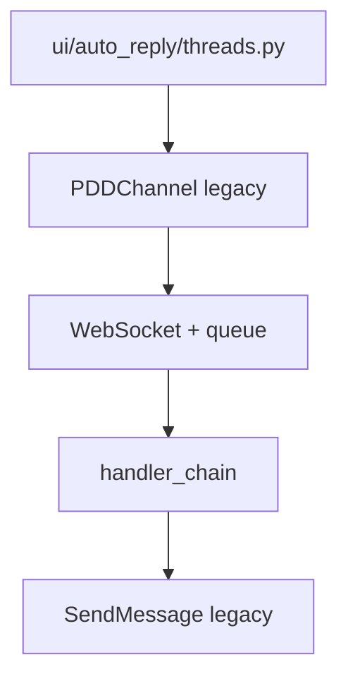
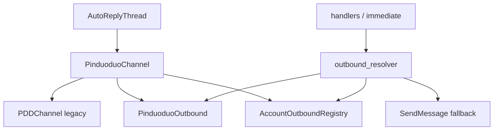

# Customer-Agent 当前架构基线（Architecture Current）

**文档导航：** [docs 目录](README.md) · [运行手册](runbook.md) · [运行模式](runtime_modes.md)

| 项 | 值 |
|---|---|
| 文档版本 | Phase 7j 里程碑（UID warning/debug log cleanup） |
| 项目路径 | `D:\agent`（本地开发根目录示例） |
| 上游 | 基于 [JC0v0/Customer-Agent](https://github.com/JC0v0/Customer-Agent) 二次开发 |
| 状态 | **拼多多单平台深化中**；多平台骨架已铺，未接淘宝/抖店/京东运行时 |

---

## 1. 当前项目目标

Customer-Agent 正在改造为**多平台电商 AI 客服工作台**，服务对象是普通电商商家，长期目标是可交付的软件产品，而不是让商家自行部署源码。

| 维度 | 当前状态 |
|------|----------|
| **第一平台** | 拼多多（Pinduoduo），WebSocket 收消息 + MMS API 出站 |
| **后续平台** | 淘宝、抖店（DouDian）、京东等（`Channel/base` 已预留 `PlatformType`） |
| **产品形态** | **本地 GUI（PyQt6）+ 本地运行**；`config.json` 配 LLM，SQLite 存账号/关键词 |
| **非目标（当前阶段）** | 完整 SaaS、多租户云端、商家自助注册、无头批量部署控制台 |

架构策略：**Strangler Fig** — 新抽象层（`Channel/base`、`PinduoduoOutbound`、`PinduoduoChannel`）包裹 legacy `PDDChannel`，默认关闭 feature flag，保证与原项目行为兼容。

---

## 2. 阶段完成情况（Phase 0 → 6b）

| Phase | 范围 | 状态 | 要点 |
|-------|------|------|------|
| **0** | 审计 / 环境 / GUI | ✅ | clone、依赖、Playwright、四主页面、`docs/phase0_audit.md`、`docs/runbook.md` |
| **1** | `Channel/base/*` | ✅ | `PlatformType`、`BaseChannel`、`ChannelOutbound`、`ChannelRegistry`、Unified 模型骨架；**未接运行时** |
| **2a** | `PinduoduoOutbound` | ✅ | 包装 `SendMessage` / `ProductManager`；factory + `USE_PINDUODUO_OUTBOUND` |
| **2b** | handler 出站 | ✅ | `ai_handler` / `keyword_handler` outbound-first + legacy fallback |
| **2c** | 即时消息出站 | ✅ | `pdd_message_handler` 撤回/转接「[玫瑰]」outbound-first |
| **3a** | `PinduoduoChannel` | ✅ | `BaseChannel` 包装 legacy `PDDChannel` |
| **3b** | UI 运行时切换 | ✅ | `AutoReplyThread` 经 `USE_PINDUODUO_CHANNEL_WRAPPER` 选 wrapper |
| **4a** | resolver 增强 | ✅ | `metadata["outbound"]` + `AccountOutboundRegistry` + create fallback |
| **4b** | registry 生命周期 | ✅ | `PinduoduoChannel` start 注册 / stop 注销 outbound |
| **5a** | 运行模式文档 | ✅ | `docs/runtime_modes.md`、`scripts/diagnose_runtime.py` |
| **5.5–5.6** | 架构基线 + 文档索引 | ✅ | `architecture_current.md`、`docs/README.md` |
| **6a** | 第二平台规划 | ✅ | `docs/phase6a_plan.md` |
| **6b** | `DemoChannel` skeleton | ✅ | `Channel/demo/*`、`PlatformType.DEMO`、Registry 双平台单测；**非生产** |
| **7a** | UnifiedMessage mapper 规划 | ✅ | `docs/phase7a_plan.md` |
| **7b** | `pdd_to_unified` mapper | ✅ | `Channel/pinduoduo/mappers/*` + fixtures |
| **7c** | UnifiedMessage shadow | ✅ | `USE_UNIFIED_MESSAGE_SHADOW`（默认 off）；旁路 log |
| **7d** | 双轨入队 | ✅ | `USE_UNIFIED_MESSAGE_DUAL_TRACK`（默认 off）；`MessageWrapper.unified_message` |
| **7e** | metadata adapter | ✅ | `Message/metadata_adapter.py`；handler **未改** |
| **7f** | extract 委托 adapter | ✅ | `get_send_context_for_extract`；`extract_pdd_send_context` 薄委托；handler **未改** |
| **7g** | metadata observability | ✅ | `Message/metadata_observability.py`；安全观测 helper |
| **7h** | handler debug 接线 | ✅ | `handle()` 入口 `log_handler_observation`；发送路径 **未改** |
| **7i** | INFO 敏感日志清理 | ✅ | `log_sanitizer`；无 content/reply 全文/完整 buyer UID |
| **7j** | UID warning/debug 清理 | ✅ | account/buyer/cs UID 脱敏；`shop_id` 明文；发送/resolver **未改** |

**未纳入本表、已暂缓：** Phase 4c（consumer 将 outbound 镜像到 `metadata`）、Phase 5b（统一 bool 解析模块）。

---

## 3. 默认运行链路（生产兼容）

### Feature flags（默认）

```text
USE_PINDUODUO_CHANNEL_WRAPPER=false   # 或未设置
USE_PINDUODUO_OUTBOUND=false          # 或未设置
```

### 端到端路径

```text
用户 GUI（自动回复页）
  → ui/auto_reply/manager.py
  → ui/auto_reply/threads.py :: AutoReplyThread
       → PDDChannel()                    # legacy，非 PinduoduoChannel
       → LifecycleMixin.start_account
            → init → WebSocket 连接
            → _setup_message_consumer → handler_chain
       → MessageHandlerMixin._message_loop
            → PDDChatMessage → Context
            → 入队 put_message 或 即时 _handle_immediate_message
  → MessageConsumer._process_message
       → metadata（shop_id / user_id / from_uid）
       → KeywordDetectionHandler → AIReplyHandler → …
  → 出站：SendMessage.send_text / move_conversation（同步 API）
```

**含义：** 与 Phase 0 审计时的 legacy 路径一致；Strangler 层存在但默认不启用。



---

## 4. 新架构完整运行链路（联调目标）

### Feature flags

```text
USE_PINDUODUO_CHANNEL_WRAPPER=true
USE_PINDUODUO_OUTBOUND=true
```

### 端到端路径

```text
AutoReplyThread
  → create_auto_reply_runtime_channel()
  → PinduoduoChannel(BaseChannel)
       → 内部 _legacy: PDDChannel（WebSocket / 队列 / 解析 不变）
       → start_account 后：
            self.outbound（lazy PinduoduoOutbound）
            AccountOutboundRegistry.register(shop_id, account_id, outbound)
  → 消息处理（同 legacy 入队 / 即时路径）
  → handler / 即时消息：
       resolve_pinduoduo_outbound(metadata, context)
         1. metadata["outbound"]（若调用方注入）
         2. AccountOutboundRegistry.get(shop_id, user_id)  ← Phase 4b
         3. create_pinduoduo_outbound（fallback）
       → await outbound.send_text / transfer_to_human
       → 失败则 legacy SendMessage
  → stop_account：
       legacy.stop_account → registry.unregister → 清空 _outbound
```

**注意：** `request_stop()` 仅停 WebSocket **不** unregister；registry 与 `stop_account` 绑定（见 §9）。



---

## 5. 关键模块职责

### 多平台骨架

| 路径 | 职责 |
|------|------|
| **`Channel/base/`** | 跨平台契约：`PlatformType`、`ChannelStatus`、`BaseChannel`、`ChannelOutbound` Protocol、`Unified*` 模型、`ChannelRegistry` 工厂表（PDD 尚未在 app 启动时 register） |

### Demo Channel（Phase 6b，非生产）

| 路径 | 职责 |
|------|------|
| **`Channel/demo/demo_channel.py`** | 第二个 `BaseChannel`；内存状态机；不联网 |
| **`Channel/demo/demo_outbound.py`** | 第二个 `ChannelOutbound`；`sent_log` + 固定 stub 数据 |
| **`Channel/demo/demo_factory.py`** | `create_demo_channel` / `register_demo_channel`（**仅测试 bootstrap**） |

### 拼多多 Unified 映射（Phase 7b，未接运行时）

| 路径 | 职责 |
|------|------|
| **`Channel/pinduoduo/mappers/pdd_to_unified.py`** | `PDDChatMessage` → `UnifiedMessage`；`compute_pdd_routing` |
| **`Channel/pinduoduo/mappers/shadow.py`** | Phase 7c：shadow log；双轨 on 时跳过重复 mapper |
| **`Channel/pinduoduo/mappers/dual_track_flags.py`** | Phase 7d：`USE_UNIFIED_MESSAGE_DUAL_TRACK` |

### 拼多多 Channel / 出站

| 路径 | 职责 |
|------|------|
| **`Channel/pinduoduo/pdd_channel.py`** | Legacy 运行时：`PDDChannel` = Connection + MessageHandler + Lifecycle + Status Mixins |
| **`Channel/pinduoduo/pinduoduo_channel.py`** | `BaseChannel` 实现；委托 legacy；管理 `outbound` 与 registry 注册/注销 |
| **`Channel/pinduoduo/pinduoduo_outbound.py`** | `ChannelOutbound` 实现；`asyncio.to_thread` 包装 `SendMessage` / `ProductManager` |
| **`Channel/pinduoduo/outbound_factory.py`** | `create_pinduoduo_outbound`；`create_auto_reply_runtime_channel`；`start_auto_reply_account`（统一 start 签名） |
| **`Channel/pinduoduo/channel_flags.py`** | `use_pinduoduo_channel_wrapper()` ← `USE_PINDUODUO_CHANNEL_WRAPPER` |
| **`Channel/pinduoduo/outbound_flags.py`** | `use_pinduoduo_outbound()` ← `USE_PINDUODUO_OUTBOUND` |

### 消息 / 出站解析

| 路径 | 职责 |
|------|------|
| **`Message/models/queue_models.py`** | `MessageWrapper`：`context`（必填）+ `unified_message`（可选，Phase 7d） |
| **`Message/core/consumer.py`** | `enrich_metadata_from_unified`；handler 仍 `handle(context, metadata)` |
| **`Message/metadata_adapter.py`** | Phase 7e：统一读取 metadata/context；7f：`get_send_context_for_extract`（legacy extract 等价） |
| **`Message/log_sanitizer.py`** | Phase 7i–7j：日志脱敏（content/reply/UID refs、`format_send_context_log`） |
| **`Message/metadata_observability.py`** | Phase 7g–7h：`build_handler_observation` + `log_handler_observation`（`logger.debug`，默认 INFO 无输出） |
| **`Message/handlers/outbound_resolver.py`** | `extract_pdd_send_context`（委托 adapter）；`resolve_pinduoduo_outbound`（metadata → registry → create） |
| **`Message/handlers/account_outbound_registry.py`** | 按 `shop_id:user_id` 线程安全缓存 `PinduoduoOutbound` |
| **`Message/handlers/ai_handler.py`** | AI 回复；`handle()` safe debug；`_send_reply` outbound-first |
| **`Message/handlers/keyword_handler.py`** | 关键词转人工；`handle()` safe debug；outbound-first |
| **`Channel/pinduoduo/core/pdd_message_handler.py`** | WS 消息路由；即时消息「[玫瑰]」outbound-first（**未改 WS 本身**） |

### UI / 运维

| 路径 | 职责 |
|------|------|
| **`ui/auto_reply/threads.py`** | 每账号一线程一 event loop；`create_auto_reply_runtime_channel` + `start_auto_reply_account`；`request_stop` |
| **`scripts/diagnose_runtime.py`** | 无 GUI/PDD 诊断：flag、模式名、import、路径存在性 |
| **`docs/runtime_modes.md`** | 运行模式 SSOT、四组合矩阵、回退说明 |

### 其它（未重构，仍为核心）

| 路径 | 职责 |
|------|------|
| `app.py` | 入口；Playwright 路径；DI |
| `Message/core/consumer.py` | 队列消费；组装 metadata |
| `Message/__init__.py` | `handler_chain`、`put_message` |
| `Agent/CustomerAgent/` | LLM Agent 工具与回复 |
| `bridge/context.py` | `Context` / `PinduoduoKwargs` |
| `config.json` | LLM API（与运行模式 flag 分离） |

---

## 6. Feature flags 与四种组合

| 变量 | 读取 | 默认 |
|------|------|------|
| `USE_PINDUODUO_CHANNEL_WRAPPER` | `channel_flags.py` → `channel_factory.create_auto_reply_runtime_channel` | **false** |
| `USE_PINDUODUO_OUTBOUND` | `outbound_flags.py` → `outbound_resolver.resolve_*` | **false** |

真值：`1` / `true` / `yes` / `on`（大小写不敏感）。

### 组合矩阵

| ID | Wrapper | Outbound | 模式名 | 行为 | 推荐场景 |
|----|---------|----------|--------|------|----------|
| **A** | off | off | `legacy-default` | `PDDChannel` + `SendMessage` | **默认开发/交付用户** |
| **B** | on | off | `wrapper-only` | `PinduoduoChannel` 委托 WS；出站仍 legacy | wrapper / `BaseChannel` 联调 |
| **C** | off | on | `outbound-only` | `PDDChannel`；每消息 `create` outbound；**不用 registry** | 单独验证出站适配器 |
| **D** | on | on | `wrapper-and-outbound` | wrapper + **registry 复用** `channel.outbound` | **新架构完整联调**（4b.5 已验启动） |

详见 [runtime_modes.md](./runtime_modes.md)。

---

## 7. 当前没有做的事情（边界）

明确 **尚未实现或未作为里程碑验收** 的项：

| 类别 | 说明 |
|------|------|
| **其它平台** | 未接淘宝、抖店、京东运行时 Channel |
| **PDD 内核** | 未重写 WebSocket 连接、消息循环、`PDDChatMessage` 解析、`pdd_login` |
| **消息系统** | **handler 仍只处理 legacy `Context`**；7d 双轨默认 off 时与 Phase 0 一致；flag on 时队列可携 `unified_message` 副本供 metadata，**不替代** Context（见 [phase7d_done.md](phase7d_done.md)） |
| **兼容策略** | **未移除** handler / 即时消息上的 legacy `SendMessage` fallback |
| **产品化** | 无 SaaS 后端、无多租户部署、无商家云端控制台 |
| **配置** | 运行模式 flag **未** UI 化、未写入 `config.json` |
| **Phase 4c** | consumer `metadata["outbound"]` 镜像 — **暂缓** |
| **真实店铺** | 文档级里程碑不假定全员有 PDD 测试店；黄金路径 #3–#8 需自备店铺复验 |
| **DemoChannel（已实现，非生产）** | Phase 6b：`PlatformType.DEMO` + `Channel/demo/*`；**不**连接真实平台，**不**验证真实登录/消息收发；**未**接入 app/UI/Message（见 [phase6b_done.md](phase6b_done.md)） |
| **第二平台运行时** | 淘宝/抖店/京东 Channel **未实现**；6a 已完成选型文档 |

---

## 8. 后续建议路线

| 阶段 | 内容 | 类型 |
|------|------|------|
| **5b（可选）** | `runtime_env.py` 统一 bool 解析；`channel_flags` / `outbound_flags` 薄封装 | 小 refactor |
| **6a** ✅ | 第二平台 Adapter **规划**：[phase6a_plan.md](phase6a_plan.md) | 仅文档 |
| **6b** ✅ | **`DemoChannel`**：[phase6b_done.md](phase6b_done.md)；Registry 双平台单测；非生产 | 小步代码 |
| **6c（可选）** | `diagnose_runtime` 只读列出 `ChannelRegistry.registered_platforms()` | 运维 |
| **7a** ✅ | UnifiedMessage **mapper 规划**：[phase7a_plan.md](phase7a_plan.md)（PDD 链路、映射、routing） | 仅文档 |
| **7b** ✅ | `pdd_to_unified` + fixtures：[phase7b_done.md](phase7b_done.md) | 小步代码 |
| **7c** ✅ | shadow 旁路 log：[phase7c_done.md](phase7c_done.md) | 可观测 |
| **7d** ✅ | 双轨入队：[phase7d_done.md](phase7d_done.md)；`USE_UNIFIED_MESSAGE_DUAL_TRACK` 默认 off | 架构 |
| **7e** ✅ | metadata adapter：[phase7e_done.md](phase7e_done.md) | 小步代码 |
| **7f** ✅ | extract 委托 adapter：[phase7f_done.md](phase7f_done.md)；发送路径 legacy 等价 | 小步代码 |
| **7g** ✅ | metadata observability helper：[phase7g_done.md](phase7g_done.md)；handler **未改** | 小步代码 |
| **7h** ✅ | handler debug 接线：[phase7h_done.md](phase7h_done.md)；默认 INFO 无新增日志 | 可观测 |
| **7i** ✅ | INFO 敏感日志清理：[phase7i_done.md](phase7i_done.md) | 可观测 |
| **7j** ✅ | UID warning/debug 清理：[phase7j_done.md](phase7j_done.md) | 可观测 |
| **7+ spike** | 真实第二平台（调研优先级：**抖店/飞鸽 > 京东/京麦 > 淘宝/千牛**） | 平台 |
| **8** | 产品化：UI 平台维度、`app.py` Registry、`unified_outbound_resolver`、第二平台 | 产品 |

接第二平台前建议：**D 模式** + 真实 PDD 店跑通 `docs/phase0_audit.md` 黄金路径，再冻结本文件为 v1 基线。

---

## 9. 风险与边界

| 风险 | 缓解 |
|------|------|
| wrapper 默认 off | 生产等同 legacy；新架构需显式开 flag |
| outbound 默认 off | 避免未充分测试时改变真实发送路径 |
| registry 仅在 **D** 有复用 | **C** 仍会每消息 `create`；文档与 diagnose 需说清 |
| `request_stop` 不 unregister | UI 停线程只打断 WS；完整清理由 `stop_account` / 连接结束触发；避免半停状态误用 outbound |
| 双 flag 独立 | 误开其一可能导致「以为全上新架构」实则只上一半 |
| Strangler 双层 Channel | 排障时区分 `PinduoduoChannel` vs `PDDChannel`（`.legacy` 属性） |

---

## 10. 开发者快速检查

```powershell
cd D:\agent

# 运行模式与 import（不启 GUI、不连 PDD）
python scripts/diagnose_runtime.py

# 全量单测（含 outbound / channel / resolver）
python -m unittest discover -s tests -v

# GUI 冒烟
python app.py

# 工作区状态
git status
```

### 相关文档索引

| 文档 | 用途 |
|------|------|
| [README.md](./README.md) | 文档目录、Phase 全表、新开发者阅读顺序 |
| [runbook.md](./runbook.md) | 安装、启动、账号 |
| [runtime_modes.md](./runtime_modes.md) | Flag 与四模式（含 [§6 诊断脚本](runtime_modes.md#6-诊断脚本)） |
| [phase0_audit.md](./phase0_audit.md) | 黄金路径清单 |

**Phase 交付记录（逐文件）：** [phase1_done.md](./phase1_done.md) · [phase2a_done.md](./phase2a_done.md) · [phase2b_done.md](./phase2b_done.md) · [phase2c_done.md](./phase2c_done.md) · [phase3_done.md](./phase3_done.md) · [phase3b_done.md](./phase3b_done.md) · [phase4a_done.md](./phase4a_done.md) · [phase4b_done.md](./phase4b_done.md) · [phase5a_done.md](./phase5a_done.md)

**环境诊断：** `python scripts/diagnose_runtime.py`（不启 GUI、不连 PDD）— 见 [runtime_modes.md §6](runtime_modes.md#6-诊断脚本) 与 [docs/README.md §运维与诊断](README.md#运维与诊断)。

---

## 11. 架构一览（目录级）

```text
D:\agent
├── app.py                          # GUI 入口
├── config.json                     # LLM（非运行模式 flag）
├── Channel/
│   ├── base/                       # 多平台抽象（Phase 1）
│   ├── demo/                       # DemoChannel（Phase 6b，非生产）
│   └── pinduoduo/
│       ├── mappers/                # pdd_to_unified（Phase 7b，未接 WS）
│       ├── pdd_channel.py          # legacy PDDChannel
│       ├── pinduoduo_channel.py    # BaseChannel 包装（Phase 3a/4b）
│       ├── pinduoduo_outbound.py   # 出站适配器（Phase 2a）
│       ├── channel_factory.py      # 运行时工厂（Phase 3b）
│       ├── channel_flags.py
│       ├── outbound_flags.py
│       └── core/                   # WS / 队列 / 解析（未 Strangler）
├── Message/
│   ├── core/consumer.py
│   └── handlers/
│       ├── outbound_resolver.py
│       ├── account_outbound_registry.py
│       ├── ai_handler.py
│       └── keyword_handler.py
├── ui/auto_reply/threads.py
├── Agent/CustomerAgent/
├── scripts/diagnose_runtime.py
└── docs/
    ├── README.md                   # 文档目录（Phase 5.6）
    ├── architecture_current.md     # 本文档
    └── runtime_modes.md
```

---

*本文档描述截至 Phase 7e 后的仓库状态；adapter 已存在但 handler 未接入；双轨与 shadow 默认关闭；UnifiedMessage 未替代 Context。*
