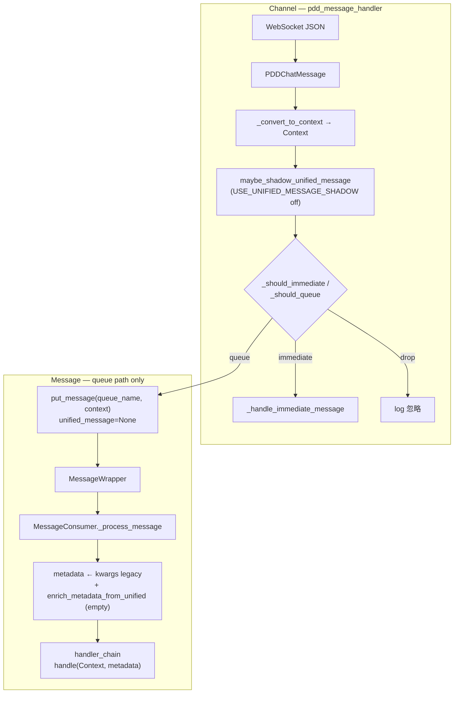

# Phase 10c 规划 — UnifiedMessage routing / content_type 与多平台对齐

| 项 | 值 |
|---|---|
| 状态 | ✅ 规划交付见 [phase10c_done.md](phase10c_done.md)；**不写代码** |
| 前置 | [phase10_account_model.md](phase10_account_model.md)（10a）、[phase10b_done.md](phase10b_done.md)（10b UI skeleton） |
| 运行时基线 | [release_checkpoint_phase9.md](release_checkpoint_phase9.md)（9d Registry 默认 on；handler 仍 Context） |

**文档导航：** [docs 目录](README.md) · [phase7a_plan.md](phase7a_plan.md) · [architecture_current.md](architecture_current.md)

---

## 1. Phase 10c 总体分析

### 1.1 目标

在 **不改动生产默认路径** 的前提下，把 **UnifiedMessage 的 `platform` / `content_type` / `routing`** 与 **10a 账号模型（`channel_name` = `platform_id`）**、**10b UI 多平台展示**、**现有 handler（Context-first）** 对齐成可执行的 SSOT，为第二平台 spike 与 10d 编码提供契约。

### 1.2 当前事实（2026-06）

| 层 | 状态 |
|----|------|
| **入站主路径** | PDD WS → `PDDChatMessage` → `Context` →（immediate \| queue \| drop） |
| **UnifiedMessage** | 7b mapper 已实现；7c shadow（默认 off）；7d dual-track（**默认 off**） |
| **Consumer / handler** | 只吃 `Context`；metadata 可含 `has_unified` + 观测字段 |
| **routing 决策** | **仍在 Channel 内**（`pdd_message_handler` 分支 + `compute_pdd_routing` 镜像） |
| **AutoReply / UI** | 10b：仅 `pinduoduo` 可启动；运行时仍 `pinduoduo.channel_factory` |
| **出站** | `resolve_pinduoduo_outbound` / unified resolver（**默认 off**） |

### 1.3 Phase 10c 定位

**文档 + 契约冻结 + 测试矩阵设计**；不启用 dual-track 默认、不改 handler 行为、不接真实第二平台。

与 Phase 8 路线 **C**（handler 按 routing 改行为）的关系：10c **只规划** C 的门控与分层；**实现**推迟到 10d 且必须 feature flag。

### 1.4 成功标准（10c 交付物）

- SSOT：`routing` / `content_type` / `platform` 跨层映射表
- 消息路径图（PDD + 未来平台占位）
- 与 `account_data["channel_name"]` 对齐策略
- handler 分层建议 + 风险清单
- 10d / spike 边界与最小安全路线
- 禁止修改文件列表 + 测试方案（设计级）

---

## 2. 当前消息路径图

### 2.1 生产默认（PDD，dual-track off）



### 2.2 可选观测路径（flag on，非默认）

| Flag | 效果 |
|------|------|
| `USE_UNIFIED_MESSAGE_SHADOW=true` | 入队/即时前旁路 `pdd_message_to_unified` + log；**不改** handler |
| `USE_UNIFIED_MESSAGE_DUAL_TRACK=true` | 入队时 `MessageWrapper.unified_message` + Consumer metadata enrich |

### 2.3 Demo 测试路径（8a，非生产 AutoReply）

```text
DemoChannel.inbound_enqueue
  → demo_raw_to_unified (routing=queue, content_type=text)
  → synthetic Context
  → put_message(demo_{shop_id}, …)
  → 同一 MessageConsumer + handler(Context)
```

### 2.4 与 10b UI 的交界

```text
account_data.channel_name  →  AutoReply 是否可启动（10b guard）
                         ↘  不进入 Message 管道（直至 WS/Channel 接入）

Message.metadata.platform  →  来自 UnifiedMessage.platform.value（仅 dual-track on）
Context.channel_type     →  bridge.ChannelType（PDD 入站已设）
```

**10c 结论：** UI 平台与 Message 平台在 **10c 仍可能不一致**（非 PDD 账号无入站）；对齐靠 **契约** 而非强制代码合并。

---

## 3. UnifiedMessage 字段契约（SSOT）

定义：`Channel/base/models.py`。

### 3.1 顶层 `UnifiedMessage`

| 字段 | 类型 | 语义 | PDD 来源 | 第二平台（规划） |
|------|------|------|----------|------------------|
| `platform` | `PlatformType` | 平台 ID | `PINDUODUO` | mapper 设 `DOUDIAN` / … |
| `message_id` | `str` | 平台消息 ID | `pdd.msg_id` | 平台 raw |
| `conversation` | `UnifiedConversation` | 会话 + 路由 extra | 见下 | 各平台 mapper |
| `direction` | `str` | `inbound` / `outbound` | `inbound` | 同左 |
| `content_type` | `str` | **平台无关**类型名 | `ContextType.value` | 平台映射到统一词汇表 |
| `content` | `Any` | 载荷 | `pdd.content`（可 dict） | 平台 raw 规范化 |
| `timestamp` | `datetime?` | 事件时间 | raw / pdd | 平台字段 |
| `raw` | `dict` | 原始 payload | WS JSON | WS/API JSON |

### 3.2 `UnifiedConversation`

| 字段 | 与 account model 对齐 |
|------|------------------------|
| `platform` | = DB `channel_name` = `account_data["channel_name"]` |
| `shop_id` | = `account_data["shop_id"]` |
| `account_id` | = `account_data["user_id"]`（卖家子账号，非买家） |
| `buyer_uid` | 买家 ID；PDD = `from_uid` |
| `conversation_id` | PDD：通常 = `buyer_uid`；其它平台待 spike 定义 |
| `extra["routing"]` | **`immediate` \| `queue` \| `drop`**（入站路由意图） |
| `extra` 其它 | `username`, `shop_name`, PDD 专有字段 |

### 3.3 Consumer metadata 镜像（7d，dual-track on）

`enrich_metadata_from_unified` 写入：

`has_unified`, `platform`, `shop_id`, `account_id`, `buyer_uid`, `conversation_id`, `content_type`, `routing`, `unified_message_id`

**发送路径仍以 legacy 为准：** `metadata.shop_id` / `user_id` / `from_uid` 来自 `Context.kwargs`（7e `get_send_context_for_extract`）。

### 3.4 `content` 形态约定（7a 已指出）

| 表示 | `content` 形态 |
|------|----------------|
| `UnifiedMessage` | 保留 str / dict / list |
| `Context`（PDD） | dict 常 `json.dumps` 为 string |
| handler | 读 `Context.content` + `Context.type` |

10c：**不**在 10c 统一形态；10d 若做 `unified_to_context` 须与 PDD 现网等价。

---

## 4. routing / content_type 设计建议

### 4.1 `routing` 应表达什么

| 值 | 含义 | 谁消费（当前） | 谁消费（未来） |
|----|------|----------------|----------------|
| **immediate** | 不入队；Channel 内同步处理 | `pdd_message_handler._handle_immediate_message` | 各平台 Channel 即时分支 |
| **queue** | 入 `"{platform}_{shop_id}"` 类队列 | `put_message` → Consumer → handlers | 同左 |
| **drop** | 显式忽略 | handler 不可见 | 同左 |

**原则：** `routing` 是 **入站分发意图**，不是 handler 名称；handler 选择仍由 `can_handle(Context.type)` + 链顺序决定。

**生成位置（规划 SSOT）：**

| 平台 | 生成者 | 函数 |
|------|--------|------|
| PDD | `Channel/pinduoduo/mappers/pdd_to_unified.py` | `compute_pdd_routing(ContextType)` |
| PDD（无 Unified） | `Message/metadata_adapter.py` | `get_routing` → 委托 `compute_pdd_routing` |
| Demo | `Channel/demo/mappers/demo_to_unified.py` | 固定 `queue`（测试） |
| 未来 | `{platform}/mappers/*_to_unified.py` | `compute_{platform}_routing(...)` |

**禁止：** 在 10c/10d 让 handler 直接解析 WS JSON 决定 routing。

### 4.2 `content_type` 词汇表（当前 PDD = `ContextType`）

| content_type | 典型 routing | 现网 handler 关注点 |
|--------------|--------------|---------------------|
| `text` | queue | AI、关键词 |
| `image`, `video`, `emotion` | queue | AI（多模态子集） |
| `goods_inquiry`, `order_info`, `goods_card`, `goods_spec` | queue | AI / 业务 |
| `system_status`, `auth`, `withdraw`, `system_hint`, `mall_cs`, `transfer` | immediate | 状态、玫瑰、转接 |
| `mall_system_msg`, `system_biz` 等 | 视 handler 集合 | 多 **drop** 或仅日志 |

**跨平台策略（10c 建议）：**

1. **统一层**：`content_type` 使用 **小写 snake** 字符串（与 `ContextType.value` 同构）。
2. **平台 mapper**：原生类型 → 统一 `content_type`；无法映射 → `unknown` + `routing=drop` 或平台专用 `extra.native_type`。
3. **不要**在 10c 为淘宝/抖店发明第二套枚举名与 PDD 并行进入 handler。

### 4.3 第二平台 routing 模板（文档级）

```text
compute_{platform}_routing(native_type, raw) -> immediate | queue | drop
  - 应对齐 PDD 语义：需要 AI/关键词的 → queue
  - 登录/心跳/撤回类 → immediate 或 drop（按平台协议 spike 填表）
```

---

## 5. platform 对齐策略

### 5.1 三层 platform 字段

| 层 | 字段 | 值示例 |
|----|------|--------|
| DB / UI | `channel_name` | `pinduoduo` |
| Unified | `UnifiedMessage.platform` | `PlatformType.PINDUODUO` |
| Context | `context.channel_type` | `ChannelType.PINDUODUO` |

**对齐规则（SSOT）：**

```text
normalize(channel_name) == platform.value == channel_type.value   # 小写字符串
```

| 场景 | 行为 |
|------|------|
| `channel_name` 缺失 | 视为 `pinduoduo`（10a/10b） |
| dual-track off | handler 见 `Context.channel_type`；metadata 无 `has_unified` |
| dual-track on | `metadata.platform` 应与 `channel_type` 一致；不一致 → **warning**（7d 已有） |
| 非 PDD 账号在 UI | 仅展示；无 WS → Message 管道无该平台流量 |

### 5.2 queue 命名与 account

| 现网 PDD | 规划 |
|----------|------|
| `queue_name = f"pdd_{shop_id}"` | 建议演进为 `f"{platform_id}_{shop_id}"`（**10d+**，需迁移策略） |
| Demo 8a | `demo_{shop_id}` 已验证 |

10c：**文档化**目标命名；**不**改 `pdd_lifecycle` queue 前缀。

### 5.3 AutoReply 与 Message 对齐时点

| Phase | 对齐程度 |
|-------|----------|
| 10b ✅ | UI：`channel_name` 决定是否可点「开始回复」 |
| 10c | 文档：Message `platform` 与 `channel_name` 契约 |
| 10d | 可选：入站 metadata 校验 `platform == account channel` |
| spike | WS 连接按 `account_data` 选 Channel / queue |

---

## 6. handler 分层建议

### 6.1 当前（保持不变）

```text
MessageConsumer
  → for handler in chain:
       if handler.can_handle(context):   # 仅 Context.type
         handle(context, metadata)
```

- `can_handle`：**不看** `metadata.routing` / `metadata.platform`（生产）。
- `metadata_adapter` / `metadata_observability`：已可读 `routing` / `content_type`（观测）。

### 6.2 推荐分层（未来，flag 门控）

| 层 | 职责 | 输入 |
|----|------|------|
| **L0 Channel** | WS 解析、routing 决策、immediate、入队 | 平台 raw |
| **L1 Mapper** | raw → UnifiedMessage（含 routing、content_type） | 平台 raw |
| **L2 Adapter（可选）** | Unified → Context（与 PDD 字符串 content 等价） | Unified |
| **L3 Consumer** | metadata enrich、链调度 | Context + metadata |
| **L4 Handler** | 业务（AI、关键词、转人工） | Context；**可选**读 metadata 观测 |
| **L5 Outbound** | 发送 | shop_id / account_id / platform |

**10c 建议：**

- **不要**在 10c 把 `can_handle` 改为 `metadata["routing"]=="queue"`（会改变 PDD 默认）。
- **10d 若做 Route C：** 新 flag，例如 `USE_HANDLER_ROUTING_METADATA=false`（默认 false）；true 时仅 **新增** `RoutingAwareHandler` 包装或调试 handler，不替换现网链。

### 6.3 是否按 platform / content_type / routing 分层？

| 维度 | 10c 建议 |
|------|----------|
| **platform** | handler **保持 PDD 专用** 直至 `resolve_outbound` 与平台 outbound 就绪；第二平台先 **独立 handler 子类** 或 `can_handle` 内检查 `channel_type`（flag 后） |
| **content_type** | 继续用 `Context.type`（= unified content_type 字符串）；跨平台复用 AI handler |
| **routing** | **仅 Channel** 决定入队；handler **不应**依赖 routing 决定是否执行（除非新 flag 显式开启） |

---

## 7. 风险点

| 风险 | 说明 | 缓解 |
|------|------|------|
| 默认开启 dual-track | metadata 与 kwargs 不一致导致观测误导 | 10c/10d **禁止**改默认；生产保持 off |
| handler 改用 Unified 入参 | 破坏全部 handler / 测试 | 保持 `handle(Context, metadata)` 至 Phase 11+ |
| routing 与 `can_handle` 双重分叉 | immediate 消息本不入队，handler 看不到 | 即时逻辑留在 Channel |
| `content` dict vs string | AI 预处理假设 string | 10d 任何 unified→context 须单测 parity |
| queue 前缀变更 | 在途消息、消费者注册 | 单独 migration Phase；10c 只文档 |
| 非 PDD UI 账号误启动 | 10b 已禁；Message 仍无流量 | 保持 10b guard + spike 前不 seed |
| Demo 与生产混淆 | `demo` platform 进生产 DB | 不默认注册 Demo；不 seed |
| Route C 过早 | 改变 AI/关键词触发条件 | flag 默认 off + 黄金路径回归 |

---

## 8. 禁止修改文件（10c 规划阶段）

10c **整阶段仅文档** 时，以下 **均不修改**：

| 类别 | 路径 |
|------|------|
| PDD 入站 | `Channel/pinduoduo/core/pdd_message_handler.py`, `pdd_lifecycle.py`, `pdd_message.py` |
| PDD mapper 行为 | `Channel/pinduoduo/mappers/pdd_to_unified.py`（已存在；10c 只引用） |
| 运行时线程 | `ui/auto_reply/threads.py`, `Channel/pinduoduo/channel_factory.py` |
| Consumer / handler | `Message/core/consumer.py`, `Message/handlers/**` |
| 默认 flag | `dual_track_flags.py`, `autoreply_registry_flags.py`, `*_flags.py` 默认值 |
| DB | `database/**` |
| 真实平台 | 淘宝/抖店/京东 WS、登录 |

10d 允许范围（需单独 plan）：mapper 扩展、metadata 契约测试、**flag 后** handler 包装；仍 **不** 默认 on dual-track。

---

## 9. 测试方案（设计级，10c 不新增代码）

### 9.1 已有覆盖（保持绿）

| 套件 | 覆盖 |
|------|------|
| `test_unified_dual_track.py` | 入队 metadata、handler 仍 Context |
| `test_metadata_adapter.py` | `get_routing` / `get_content_type` / platform |
| `test_unified_shadow.py` | shadow 旁路 |
| `test_demo_runtime_flow.py` | Demo unified + routing=queue |
| `test_auto_reply_platform_ui.py` | UI platform guard（10b） |

### 9.2 10d 建议新增（规划）

| 测试 | 目的 |
|------|------|
| `test_routing_parity_pdd.py` | 每个 `ContextType` ↔ `compute_pdd_routing` ↔ handler 可见性表 |
| `test_platform_metadata_alignment.py` | dual-track on：`metadata.platform` == `context.channel_type` |
| `test_cross_platform_content_type_vocab.py` | 文档表驱动：平台原生类型 → 统一 content_type |
| 黄金路径 | `phase0_audit` + PDD 店；flag off 回归 |

### 9.3 手工

- `USE_UNIFIED_MESSAGE_DUAL_TRACK=true`：仅开发机验证 metadata，**不作为发布默认**。
- 10b UI：非 PDD 不可启动；PDD 启停与 9d 一致。

---

## 10. 最小安全路线

```text
10c（本文）     → SSOT + 映射表 + 风险 + 10d 边界
10d（编码）     → 契约测试 + 可选 mapper 表驱动测试；不改 handler 默认
独立 spike      → 单平台 WS + mapper + queue 前缀 POC；不接 AutoReply UI 生产
10e（规划）     → queue 命名 / Consumer 多平台注册（flag）
11+（远期）     → handler Route C（flag）或 Unified-first Consumer（高风险）
```

**原则：**

1. **Context-first** 直至第二平台 outbound + 黄金路径通过。
2. **routing 只在 Channel/mapper 生成**。
3. **platform 字符串全栈统一** = `channel_name`。
4. **任何行为变化** = 新 flag，默认与 Phase 9d/7d 一致。

---

## 11. Phase 10d 建议 Prompt（复制用）

```text
继续 Phase 10d：UnifiedMessage routing / content_type 契约落地（小步代码）。

先读：docs/phase10c_plan.md、docs/phase10_account_model.md、Channel/pinduoduo/mappers/pdd_to_unified.py、Message/metadata_adapter.py。

目标：
- 新增表驱动单测：ContextType ↔ compute_pdd_routing ↔ queue/immediate/drop
- 新增 platform/metadata 对齐测试（dual-track flag 仅在测试中显式 true）
- 可选：docs/phase10c_done.md + 更新 architecture_current / phase10_account_model §9 后续节

禁止：
- 不改 pdd_message_handler / consumer / handlers 默认行为
- 不改 USE_UNIFIED_MESSAGE_DUAL_TRACK 默认（false）
- 不改 AutoReplyThread / channel_factory / 9d registry 默认
- 不接真实第二平台 WS
- 不默认启用 handler Route C

验收：python -m unittest discover -s tests -v；PDD 黄金路径说明；git diff 可控。
```

---

## 12. 10c 仅文档 vs 推迟到 10d / spike

| 内容 | 10c（文档） | 10d | 独立 spike |
|------|-------------|-----|------------|
| routing/content_type SSOT | ✅ | 引用 | 平台填表 |
| 跨平台 content_type 映射表 | ✅ 模板 | 单测 | 真实类型枚举 |
| platform = channel_name | ✅ | metadata 断言测试 | WS 账号绑定 |
| handler Route C | ✅ 设计 + flag 名 | 可选包装 | — |
| queue 前缀 `pdd_` → `{platform}_` | ✅ 文档 | 迁移实现 | POC |
| `unified_to_context` | ✅ 规则 | 可选实现 + parity 测 | — |
| 第二平台 mapper | — | Demo 扩展示例 | 真实协议 |
| Consumer 多 handler 按 platform | — | — | spike 后 |

---

*规划版本：Phase 10c · 2026-06-03 · 无代码变更 · 收尾 [phase10c_done.md](phase10c_done.md)*
