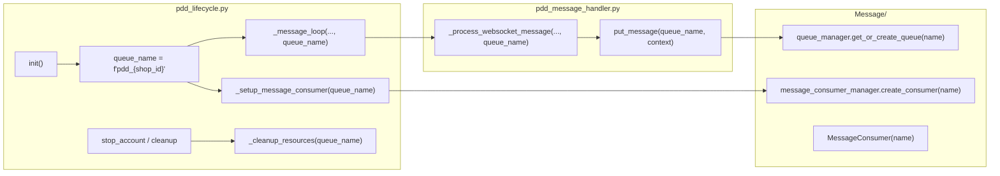

# Phase 10e 规划 — Queue 命名与多平台 Message 边界

| 项 | 值 |
|---|---|
| 状态 | ✅ 交付见 [phase10e_done.md](phase10e_done.md)；推荐 **Route A**（纯文档） |
| 前置 | [phase10c_done.md](phase10c_done.md)、[phase10d_done.md](phase10d_done.md)、[phase10_account_model.md](phase10_account_model.md) |
| 约束 | **不改** PDD 默认 `pdd_{shop_id}`；不改 Consumer/handlers 生产行为 |

**文档导航：** [docs 目录](README.md) · [architecture_current.md](architecture_current.md)

---

## 1. Phase 10e 总体分析

### 1.1 目标

在 **10a–10d** 已锁定 `platform_id`、`routing`、`content_type` 契约的基础上，规划：

1. **queue 命名** 如何与 `channel_name` / `platform_id` 对齐；
2. **platform-aware routing** 与 **queue 隔离** 的职责边界；
3. **Consumer「多平台」** 在现架构下意味着什么（无需改 `MessageConsumer` 类即可多队列并存）。

为 **真实第二平台 spike** 提供命名与迁移 SSOT，**不改变 PDD 默认运行行为**。

### 1.2 推荐路线：**Route A（10e）**

**只做文档规划**，不改代码。安全，与当前「生产默认冻结」策略一致。

### 1.3 与 Phase 10 系列关系

| Phase | 内容 |
|-------|------|
| 10a–10b | 账号模型 + UI skeleton |
| 10c–10d | routing/platform SSOT + 契约测试 |
| **10e** | queue 命名 + Consumer 边界 **文档** |
| **10f** | （可选）`queue_name` helper + 单测，PDD 仍 `pdd_{shop_id}` |
| **spike** | 第二平台 WS + `doudian_{shop_id}` 等实队列 |
| **11+** | Consumer 按 platform 分 handler 链（Route D，高风险） |

---

## 2. 当前 queue 生成路径



| 步骤 | 位置 | 行为 |
|------|------|------|
| 1 | `LifecycleMixin.init` | `queue_name = f"pdd_{shop_id}"`（L131） |
| 2 | `_setup_message_consumer` | `create_consumer` + `handler_chain` + `start_consumer` |
| 3 | WS 循环 | 每条入站消息带同一 `queue_name` |
| 4 | 入队 | `_should_queue_message` → `put_message(queue_name, context)` |
| 5 | 停止 | `stop_account` / 重连清理 → `_cleanup_resources(f"pdd_{shop_id}")`（L115, 224, 247, 257） |

**其它入口：**

| 入口 | queue 名来源 |
|------|----------------|
| `Message.put_message` / `enqueue_inbound_message` | **调用方传入** |
| Demo 8a | 测试构造 `demo_{shop_id}`（`test_demo_runtime_flow._QUEUE`） |
| 单测 | 任意字符串（`test_dual_off` 等） |

**AutoReplyThread / channel_factory：** 不直接构造 queue 名；queue 在 **PDDChannel 生命周期 init** 内绑定 `shop_id`。

---

## 3. `pdd_{shop_id}` 兼容性分析

### 3.1 是否强绑定？

| 维度 | 结论 |
|------|------|
| **生产 PDD** | **是** — 唯一生成点为 `pdd_lifecycle` 字面量 `f"pdd_{shop_id}"` |
| **与 platform_id** | **弱绑定** — 前缀是历史缩写 `pdd`，不是 SSOT 字符串 `pinduoduo` |
| **与 shop_id** | **强绑定** — 一店一队列、一 Consumer |
| **跨平台冲突** | 若两平台共用同一 `shop_id` 字符串会撞名 → **应用 `{platform_id}_{shop_id}` 避免**（仅新平台） |

### 3.2 为何保留 `pdd_` 而非 `pinduoduo_`

| 因素 | 说明 |
|------|------|
| 历史 | `phase0_audit`、黄金路径、运维日志均假设 `pdd_*` |
| 风险 | 改名导致在途 Consumer/队列失联、需停账号重建 |
| SSOT | `channel_name`/`platform_id` 已是 `pinduoduo`；queue 前缀可视为 **PDD 实现细节** |

### 3.3 是否需兼容层

| 策略 | 10e 建议 |
|------|----------|
| **PDD 生产** | **永久保留** `pdd_{shop_id}` 为 canonical（直至显式 major migration） |
| **新平台** | 使用 `{platform_id}_{shop_id}`（如 `doudian_{shop_id}`） |
| **helper（10f）** | `build_queue_name("pinduoduo", shop_id) -> f"pdd_{shop_id}"` 显式映射；`build_queue_name("doudian", shop_id) -> f"doudian_{shop_id}"` |
| **双写/别名** | 非 10e/10f 范围；仅 spike 评估 |

---

## 4. 多平台 queue naming 推荐

### 4.1 目标格式（SSOT）

```text
queue_name = f"{platform_prefix}_{shop_id}"

platform_prefix 规则：
  pinduoduo  →  "pdd"          # 生产兼容，非改名
  demo       →  "demo"         # 8a 已用
  doudian    →  "doudian"
  jingdong   →  "jingdong"
  taobao     →  "taobao"
  unknown    →  normalize(platform_id)  # 与 channel_name 小写一致
```

### 4.2 三方案对比（用户问题 3）

| 方案 | 描述 | 10e 结论 |
|------|------|----------|
| **A. 保持 `pdd_{shop_id}`** | PDD 不变；第二平台新前缀 | ✅ **推荐（生产）** |
| **B. 统一 `{platform_id}_{shop_id}`** | PDD 变为 `pinduoduo_{shop_id}` | ❌ 高迁移成本（Route C） |
| **C. 仅第二平台新设计** | PDD 旧名 + 新平台 `{platform}_{shop}` | ✅ **与 A 等价，推荐写法** |

**不推荐** 现在把 PDD 改成 `pinduoduo_{shop_id}`。

### 4.3 与 account / routing 的关系

| 概念 | 职责 |
|------|------|
| **`routing`** | 是否入队（immediate / queue / drop）— Channel/mapper，[10c/10d](phase10c_done.md) |
| **`queue_name`** | 入队后的 **隔离键**（按店/平台分 Consumer） |
| **`platform_id`** | 账号与 UnifiedMessage 语义；**不替代** queue 前缀 |

```text
channel_name=pinduoduo + shop_id=S1  →  queue_name=pdd_S1     （生产）
channel_name=doudian   + shop_id=S2  →  queue_name=doudian_S2 （spike 后）
```

---

## 5. 是否需要 queue helper

| 时机 | 建议 |
|------|------|
| **10e** | **文档定义** `build_queue_name(platform_id, shop_id) -> str` 契约即可 |
| **10f** | **实现** helper + 单测；**唯一** 生产调用点暂不替换（或仅 Demo/spike 使用） |
| **spike** | 第二平台 lifecycle 使用 helper |
| **PDD migration** | 仅在显式 Phase 中把 `pdd_lifecycle` 三处 f-string 改为 helper（行为仍为 `pdd_*`） |

**helper 好处：** 单测锁定 `pinduoduo`→`pdd` 映射；避免新平台误写 `pdd_` 前缀。

---

## 6. 是否现在改 PDD queue name

**否。**

| 若改为 `pinduoduo_{shop_id}` 的影响面 |
|--------------------------------------|
| `pdd_lifecycle.py` init/stop/cleanup（5+ 处） |
| 运行中 `message_consumer_manager` / `queue_manager` 注册名 |
| 日志、诊断、运维手册 |
| `test_demo_runtime_flow.test_does_not_pollute_pdd_queue` 等假设 |
| 需 **停全店 AutoReply** 重建 Consumer — 生产不可用 |

10e/10f **不执行** 该迁移。

---

## 7. Route A / B / C / D 对比

| Route | 内容 | 风险 | Phase |
|-------|------|------|-------|
| **A** | 仅文档：命名 SSOT、边界、迁移策略 | 最低 | **10e ✅ 推荐** |
| **B** | 新增 `Message/queue_naming.py`（或 `Channel/base/queue_names.py`）；PDD 返回 `pdd_{shop_id}`；单测 | 低 | **10f** |
| **C** | PDD 改为 `pinduoduo_{shop_id}` | **高** | 不推荐；独立 migration Phase |
| **D** | `MessageConsumer` 多平台化（按 platform 选 handler/outbound） | **高** | 推迟 spike 后 / 11+ |

---

## 8. 最小安全路线

```text
10e（本文）     → queue 命名 SSOT + Consumer 边界 + 禁止改 PDD 默认
10f（可选）     → build_queue_name + tests；PDD lifecycle 仍字面量或 helper 同输出
spike           → 第二平台 lifecycle 使用 doudian_{shop_id} + 独立 Consumer
10g?（可选）    → pdd_lifecycle 改用 helper（输出不变，纯 refactor）
major migration → 仅当产品要求 pinduoduo_{shop_id} + 停服计划
11+             → Consumer 按 platform 分链（flag）
```

**原则：**

1. **PDD 默认路径一字不变**（10e）。
2. **routing 仍在 Channel**；queue 只负责隔离。
3. **Consumer 已支持多队列** — 「多平台」= 多 `queue_name` 并存，非改类。
4. **handler 仍 Context-first**；platform 来自 `context.channel_type` / metadata。

---

## 9. 禁止修改文件（10e 规划期）

与 10c/10d 一致，**10e 整阶段仅文档** 时不改：

| 类别 | 路径 |
|------|------|
| Queue 生成 | `Channel/pinduoduo/core/pdd_lifecycle.py` |
| 入站 | `pdd_message_handler.py` |
| Consumer / handler | `Message/core/consumer.py`, `Message/handlers/**` |
| Flag | `*_flags.py` 默认值 |
| AutoReply | `ui/auto_reply/threads.py`, `channel_factory.py` |
| UI / DB | `ui/**`, `database/**` |

---

## 10. 测试方案

### 10.1 10e（规划）

- 无新增测试；引用 [phase10d](phase10d_done.md) 已有 parity。

### 10.2 10f（helper 阶段）

| 测试 | 内容 |
|------|------|
| `test_queue_naming.py` | `build_queue_name("pinduoduo", s) == f"pdd_{s}"` |
| | `build_queue_name("doudian", s) == f"doudian_{s}"` |
| | `build_queue_name("demo", s) == f"demo_{s}"` |
| | 非法/空 platform → 文档约定异常或 fallback |
| 回归 | 全量 `unittest`；**不**改 `pdd_lifecycle` 时零行为差 |

### 10.3 spike

- `test_*_runtime_flow` 仿 `test_demo_runtime_flow`：`{platform}_{shop}` 隔离、不污染 `pdd_*` 队列。

---

## 11. 文档更新方案

### 11.1 10e 交付（规划阶段）

| 文件 | 操作 |
|------|------|
| `docs/phase10e_plan.md` | 本文 |
| `docs/phase10e_done.md` | 10e 收尾时（若仅规划则 done=确认 Route A） |

### 11.2 10e 收尾 / 10f 完成后

| 文件 | 更新 |
|------|------|
| `architecture_current.md` | Phase 10e 行；queue 命名 SSOT 小节 |
| `docs/README.md` | Phase 10e/10f 索引 |
| `phase10_account_model.md` | §4 增加 `queue_name` 与 `channel_name` 映射表 |
| `phase10c_plan.md` | queue 前缀「10e 已文档化」脚注（可选） |

---

## 12. Consumer 多平台边界（SSOT）

### 12.1 现状

```text
message_consumer_manager: Dict[queue_name, MessageConsumer]
  → 每个 queue_name 一个 Consumer 实例
  → 同一 handler_chain（AI + keyword + …）
  → can_handle 仅看 Context.type，不看 queue_name
```

### 12.2 「多平台」在 10e 的含义

| 层 | 多平台支持方式 |
|----|----------------|
| **隔离** | 不同 `queue_name`（`pdd_S1` vs `doudian_S2`） |
| **语义** | `Context.channel_type` / `metadata.platform`（10d 已测） |
| **出站** | `resolve_outbound` / PDD registry（默认仍 PDD） |
| **非目标** | 一个 Consumer 内按 platform 路由到不同 handler 集（Route D） |

### 12.3 platform-aware routing boundary

| 边界 | 负责模块 | 不负责 |
|------|----------|--------|
| **是否入队** | `pdd_message_handler` + `compute_pdd_routing` | `queue_name` 格式 |
| **入哪个队列** | lifecycle 传入的 `queue_name` | handler `can_handle` |
| **谁处理** | `MessageConsumer` + handler_chain | WS 解析 |
| **发到哪** | outbound resolver + shop_id/user_id | queue 前缀 |

---

## 13. 必须推迟到 spike / 后续 Phase

| 内容 | 推迟原因 |
|------|----------|
| 抖店/淘宝/京东 WS + lifecycle | 协议与登录 |
| 生产 DB 第二平台 seed | 10a/10b 禁止 |
| `pdd_` → `pinduoduo_` 迁移 | 停服与双写 |
| Consumer 按 platform 不同 handler 链 | Route D |
| AutoReply 按 `channel_name` 选 queue | 依赖 Channel 多平台 runtime |
| `enqueue_inbound_message` 默认改 PDD 调用点 | 行为面 |

---

## 14. Phase 10f 建议 Prompt（复制用）

```text
继续 Phase 10f：queue_name helper + 契约测试（小步，PDD 行为不变）。

先读：docs/phase10e_plan.md、phase10_account_model.md、pdd_lifecycle.py（只读）。

实现：
1. 新增 Message/queue_naming.py（或 Channel/base/queue_naming.py）：
   build_queue_name(platform_id: str, shop_id: str) -> str
   - pinduoduo / 缺省 → f"pdd_{shop_id}"
   - demo → f"demo_{shop_id}"
   - 其它 → f"{normalize(platform_id)}_{shop_id}"
2. 新增 tests/test_queue_naming.py 表驱动
3. 可选：Demo enqueue 改用 helper（输出仍为 demo_{shop}）
4. 不修改 pdd_lifecycle 中 f"pdd_{shop_id}"（或改 helper 但单测断言输出完全一致）
5. docs/phase10f_done.md；更新 architecture_current、README

禁止：
- 不改 pdd_{shop_id} 生产字符串结果
- 不改 consumer/handlers/pdd_message_handler 逻辑
- 不改 flag 默认、UI、DB、AutoReplyThread、channel_factory
- 不接真实第二平台

验收：python -m unittest discover -s tests -v；git diff 可控。
```

---

*规划版本：Phase 10e · 2026-06-03 · Route A · 无代码变更*
