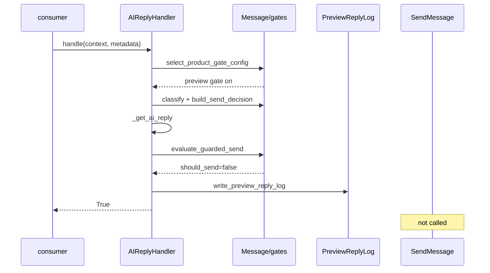

# Phase 13c — Preview Integration Flow

| 项 | 值 |
|----|-----|
| 类型 | docs only |
| 实现 | Phase **13d** |
| 代码参考 | `Message/handlers/ai_handler.py` · `Message/gates/*` |

---

## 1. 设计原则

| 原则 | 说明 |
|------|------|
| **生成与发送解耦** | Preview 可 `_get_ai_reply`；**禁止**随后 `_send_reply` |
| **早分支** | gate selection 在 AI 之后、send 之前；test shop 不进入 `_send_reply` |
| **final guard** | `evaluate_guarded_send` 为发送前最后一道关；preview 路径 guard 结果 `should_send=false` |
| **可观测** | preview 结果写入 ReplyLog（或 13d in-memory preview log）供 Dashboard |
| **shadow 并存** | 13b shadow 可对全店 fail-open；test shop 额外写 gate-on decision |

---

## 2. 现有 flow（as-is · 13b 生产）

```text
AIReplyHandler.handle()
  → log_handler_observation
  → preprocess (MessagePreprocessor)
  → _try_shadow_log_send_decision()     # product_gate_enabled=false, fail-open
  → _get_ai_reply()
  → (fallback if empty)
  → _send_reply()
       → resolve_pinduoduo_outbound()?
       → SendMessage.send_text() / outbound.send_text   # legacy
  → return True/False
```

**不变量：** 全店 `product_gate_enabled=false`；shadow 不改变上述 send 条件。

---

## 3. 未来 flow — non-test shop（13d 后仍不变）

```text
AIReplyHandler.handle()
  → preprocess
  → select_product_gate_config() → MISS (legacy)
  → _try_shadow_log_send_decision()     # 可选保留
  → _get_ai_reply()
  → _send_reply()                       # 与今日完全一致
  → return True/False
```

**验收：** Z2 · Z5 · Z8 — legacy send 仍发生；`evaluate_guarded_send` 不被 gate-on 路径要求。

---

## 4. 未来 flow — test shop preview gate（13d 目标）

```text
AIReplyHandler.handle()
  → preprocess
  → select_product_gate_config() → HIT (preview gate on)
  → classify_consultation_intent(processed_content)
  → build_send_decision(
        classification,
        reply_mode=preview,
        product_gate_enabled=true,
        workspace_pause=...,
        shop_pause=...,
     )
  → _get_ai_reply()                    # 生成建议（allowed_to_generate 依 decision）
  → if not reply: fallback / return (与现逻辑对齐，但不 send)
  → evaluate_guarded_send(decision, reply_text)
  → write_preview_reply_log(...)       # in-memory 或 port；send_status=not_sent_preview
  → return True                        # handler 成功 = 「已处理」≠ 「已发送」
  → *** 不调用 _send_reply ***
  → *** 不调用 SendMessage / outbound.send_text ***
```

### 4.1 blocked intent 分支（test shop）

```text
  → build_send_decision → intent_bucket=blocked
  → evaluate_guarded_send → should_send=false
  → write_reply_log(send_status=not_sent_human_takeover, blocked_reason=...)
  → return True (no send)
```

### 4.2 paused 分支

```text
  → workspace_pause or shop_pause
  → allowed_to_send=false
  → send_status=not_sent_paused (或 12e 等价枚举)
  → no send
```

### 4.3 classifier / gate 异常（test shop fail-safe）

```text
  → except: log error
  → decision = uncertain + allowed_to_send=false
  → no _send_reply
  → return True or False per 13d 约定（建议 True + not_sent_safe — 不 crash consumer）
```

---

## 5. 模块插入点（13d 实现草图）

| 步骤 | 位置 | 新增/变更 |
|------|------|-----------|
| S0 | `Message/gates/test_shop_config.py`（新，13d） | `select_product_gate_config` · allowlist 加载 |
| S1 | `ai_handler.handle` 开头 | 调用 S0；**不**改 preprocessor 契约 |
| S2 | test shop 分支 | 替换「shadow + send」为「classify + decision + generate + guard + log」 |
| S3 | non-test shop | 保持 13b 路径 |
| S4 | `Message/ports/preview_reply_log.py`（新，13d） | in-memory writer |
| S5 | `guarded_send` | 仅 test shop 路径调用；**不**接 SendMessage |

**禁止 13d：**

- 在 `_send_reply` 内加 `if preview: return` 而不跳过调用方（易漏网）
- 在 `SendMessage` 内加 gate（违反 I6）
- 默认全店走 S2

---

## 6. ReplyLog / preview log（分期）

| Phase | 存储 | `send_status` |
|-------|------|---------------|
| **13d** | `InMemoryPreviewReplyLog`（list + clear for tests） | `not_sent_preview` · `not_sent_human_takeover` · `not_sent_paused` |
| **13e** | 对齐 [phase12e_send_decision_reply_log_schema.md](phase12e_send_decision_reply_log_schema.md) | 同上 + `decision_id` FK |
| **13f+ / 12g** | Dashboard 读模型 | [phase12d_reply_activity_read_model.md](phase12d_reply_activity_read_model.md) |

**13d 最小字段：**

- `shop_id`, `buyer_id`, `message_id`, `buyer_message`, `ai_suggested_reply`
- `intent`, `intent_bucket`, `send_status`, `created_at`
- `product_gate_enabled=true`, `reply_mode=preview`

---

## 7. 与 keyword handler 的关系

| 场景 | 行为 |
|------|------|
| test shop + TEXT | Keyword 链仍可能先 `transfer_to_human` 并 break；**13d 需文档化**是否与 preview 分支互斥 |
| **建议（13d）：** | consumer 链顺序不变；若 keyword 已 break，AI handler 不运行 — **与今日一致** |
| test shop 仅 AI 路径 | 本文 §4 flow 适用 |

---

## 8. Shadow logging 共存

| 店 | shadow (13b) | gate-on log |
|----|--------------|-------------|
| non-test | `product_gate_enabled=false` shadow | — |
| test | 可保留 shadow（对比 gate-off 记录 vs gate-on decision） | preview ReplyLog |

**13d 可选：** test shop 跳过 shadow 或 shadow 标记 `mode=shadow_only` 避免混淆。

---

## 9. 序列图（test shop）



---

*Integration flow · Phase 13c · 2026-06-03*
