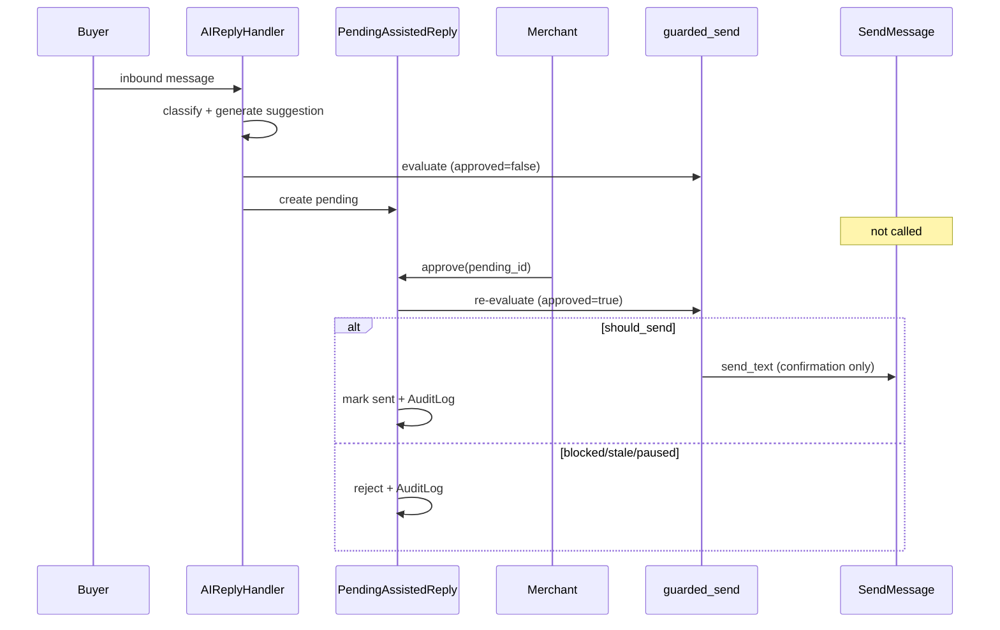

# Phase 13f — Assisted Confirmation Flow

| 项 | 值 |
|----|-----|
| 类型 | docs only |
| 实现 | Phase **14c**（代码） |

---

## 1. 设计原则

| 原则 | 说明 |
|------|------|
| **生成 ≠ 发送** | AI 阶段只写 pending / ReplyLog；**零** SendMessage |
| **确认 ≠ 生成** | 发送只发生在 merchant confirmation command |
| **Re-check on confirm** | 确认时重读 pause / intent / stale / permission |
| **Idempotent send** | 同一 pending 只能成功发送一次 |

---

## 2. Preview 当前 flow（as-is · 13d/13e）

```text
AIReplyHandler.handle()
  → preprocess
  → select_product_gate_config() → preview gate on
  → classify_consultation_intent
  → build_send_decision(reply_mode=preview, product_gate_enabled=true)
  → _get_ai_reply()                    # suggested reply
  → evaluate_guarded_send()
  → append_preview_log()
  → list_preview_reply_logs()          # 13e projection
  → return True
  → *** zero-send ***
```

---

## 3. 未来 Assisted — AI 生成阶段（no-send）

```text
AIReplyHandler.handle()
  → preprocess
  → select_product_gate_config() → assisted gate on
  → classify_consultation_intent
  → build_send_decision(reply_mode=assisted, product_gate_enabled=true)
  → _get_ai_reply()                    # suggested reply only
  → forbidden_promise_scan(reply)      # 见 risk_controls
  → evaluate_guarded_send(decision, reply, merchant_approved=false)
  → create_pending_assisted_reply()    # status=awaiting_approval
  → append_reply_log(send_status=not_sent_awaiting_approval)
  → return True
  → *** 不调用 _send_reply / SendMessage / outbound ***
```

### 3.1 blocked / uncertain 分支

| intent | AI 阶段行为 |
|--------|-------------|
| `allowed` + low risk | pending + awaiting_approval |
| `blocked` | **无** 普通 pending；`human_takeover` + 队列项；确认 UI 禁用或 elevated only |
| `uncertain` | pending 但 **禁止一键发送**；须人工编辑 + elevated confirm |
| `paused` | 不创建可发送 pending；`not_sent_paused` |

---

## 4. 未来 Assisted — 商家确认阶段（唯一 send 入口）

```text
MerchantConsole / API command: approve_assisted_reply(pending_id, ...)
  → authenticate actor_member_id
  → authorize(role >= operator)
  → load PendingAssistedReply + original buyer_message snapshot
  → check stale (expired / superseded by newer buyer message)
  → check workspace_pause / shop_pause == false
  → re-classify(original buyer_message) OR use frozen decision snapshot
  → build_send_decision(reply_mode=assisted, product_gate_enabled=true)
  → forbidden_promise_scan(final_reply_text)
  → evaluate_guarded_send(decision, final_reply, merchant_approved=true)
  → if should_send == false → reject + AuditLog assisted_reply_rejected
  → send_text_guarded / outbound.send_text / SendMessage   # ONLY HERE
  → update ReplyLog: send_status=sent, sent_at, final_reply
  → mark pending: status=approved_sent
  → write AuditLog(action=assisted_reply_approved)
```

**Reject flow：**

```text
reject_assisted_reply(pending_id, reason)
  → authorize(operator+)
  → mark pending=rejected
  → ReplyLog send_status=not_sent_rejected (或保留 awaiting + rejected flag)
  → AuditLog(action=assisted_reply_rejected)
  → no send
```

---

## 5. 时序图



---

## 6. 状态机（PendingAssistedReply · 规划）

| 状态 | 含义 | 可 approve? |
|------|------|-------------|
| `awaiting_approval` | 待商家确认 | ✅（若 guard 通过） |
| `stale` | 过期或被新消息覆盖 | ❌ |
| `approved_sent` | 已确认并发送 | ❌（终态） |
| `rejected` | 商家拒绝 | ❌ |
| `superseded` | 同会话新 pending 取代 | ❌ |

---

## 7. 与 Preview 共存

| 店 reply_mode | AI handler 分支 |
|---------------|-----------------|
| `preview` | 13d 路径 · zero-send · **不变** |
| `assisted` | 新 pending 路径 · zero-send at AI stage |
| legacy (gate off) | `_send_reply` · **不变** |

**同一 handler 文件：** 早分支按 `gate_config.reply_mode` 分流；**禁止** assisted 走 preview 的 append-only 后误调 `_send_reply`。

---

## 8. Confirmation 前必检清单

- [ ] `product_gate_enabled=true` 且 shop 仍在 allowlist
- [ ] `workspace_pause` / `shop_pause` == false
- [ ] pending 非 stale / superseded
- [ ] actor 角色 >= operator
- [ ] intent 非 blocked（或 elevated 审批已通过）
- [ ] uncertain → `final_reply` 已人工编辑
- [ ] forbidden_promise_scan 通过
- [ ] `evaluate_guarded_send(..., merchant_approved=true).should_send == true`

---

*Confirmation flow · Phase 13f · 2026-06-03*
