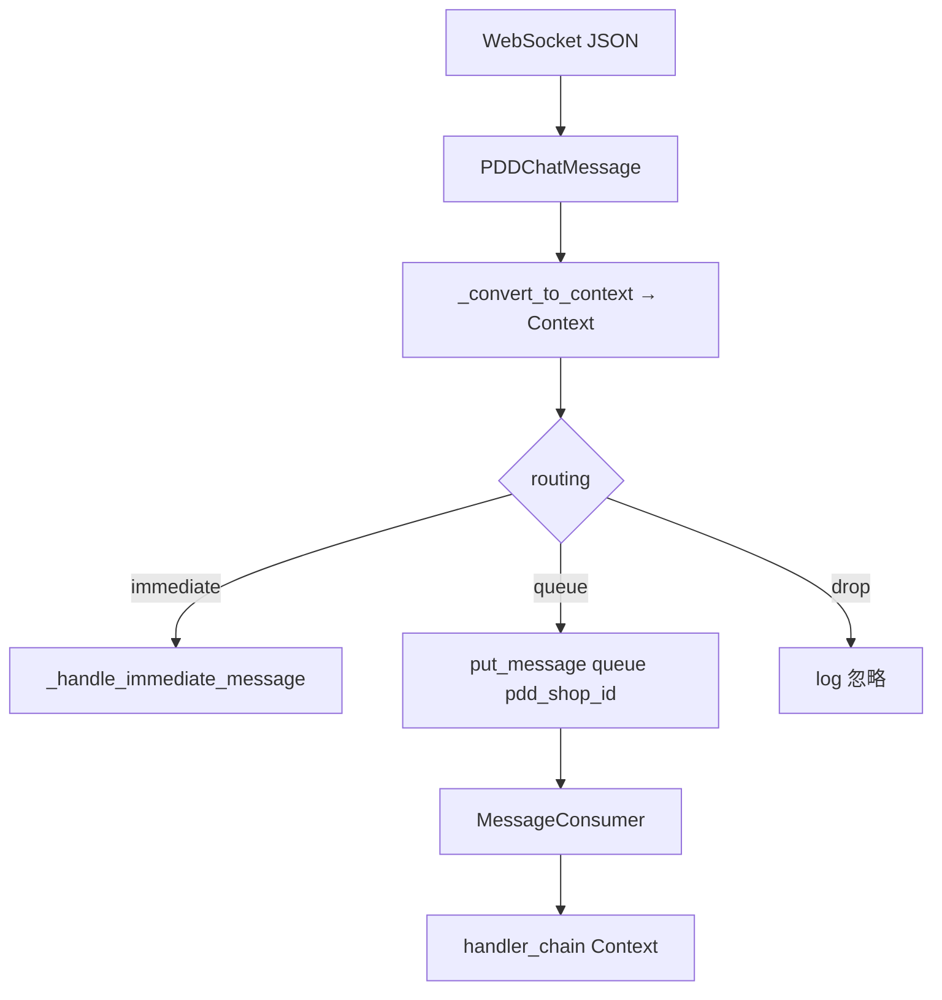

# Phase 7a：UnifiedMessage Mapper 规划

| 项 | 值 |
|---|---|
| 完成范围 | **仅规划文档**（本文件） |
| 状态 | Phase 7a 交付 |
| 下一里程碑 | Phase 7b — `pdd_to_unified` mapper + fixtures + 单测（不接运行时） |
| 相关基线 | [architecture_current.md](architecture_current.md)、[phase6b_done.md](phase6b_done.md) |

**文档导航：** [docs 目录](README.md) · [当前架构](architecture_current.md)

---

## 1. 背景与目标

### 1.1 当前问题

Phase 6b 已证明 `BaseChannel` / `ChannelOutbound` / `ChannelRegistry` 可承载第二个平台（`DemoChannel`），但 **Message / handler 体系仍以 PDD 专用 `Context` 为主**：

| 组件 | 现状 |
|------|------|
| `bridge/context.py` | `Context` + `PinduoduoKwargs` + `ChannelType` |
| `PDDChatMessage` | PDD WS JSON 解析与 `ContextType` 分发 |
| `MessageConsumer` | 消费 `MessageWrapper.context: Context` |
| `handler_chain` | `can_handle` / `handle(Context, metadata)` |
| `outbound_resolver` | 仅 PDD `shop_id` / `user_id` |
| `UnifiedMessage` / `UnifiedConversation` | 已在 `Channel/base/models.py` 定义，**未接入真实消息链路** |

### 1.2 Phase 7a 目标

设计 **mapper 层**，规划如何从 PDD 专用 `Context` 逐步过渡到 `UnifiedMessage`，**不破坏 PDD 默认运行路径**。

本 Phase **不写 mapper 代码**；实现留给 Phase 7b。

### 1.3 策略：Strangler + 双轨

```text
当前（生产，不变）:
  WS JSON → PDDChatMessage → Context → put_message → Consumer → handlers(Context)

目标（渐进）:
  WS JSON → PDDChatMessage ─┬→ Context → …           # 主路径至 Phase 7d 前
                            └→ UnifiedMessage → …    # 7b 纯函数；7c shadow；7d 可选入队
```

---

## 2. 当前 PDD 消息真实链路

### 2.1 端到端步骤

| # | 位置 | 动作 |
|---|------|------|
| 1 | `Channel/pinduoduo/core/pdd_lifecycle.py` | `start_account` → `queue_name = f"pdd_{shop_id}"` |
| 2 | `pdd_lifecycle._message_loop` | WebSocket 接收 JSON 字符串 |
| 3 | `pdd_message_handler._process_websocket_message` | `json.loads` → `PDDChatMessage(message_data)` |
| 4 | `pdd_message_handler._convert_to_context` | `PDDChatMessage` + `shop_id` / `user_id` / `username` → `Context` |
| 5a | 即时分支 | `_should_process_immediately` → `_handle_immediate_message`（不入队） |
| 5b | 入队分支 | `_should_queue_message` → `put_message(queue_name, context)` |
| 6 | `Message/core/queue.py` | `MessageWrapper(context=Context)` 入 `pdd_{shop_id}` 队列 |
| 7 | `Message/core/consumer.py` | `_process_message` → 从 `kwargs` 填 `metadata` → `handler_chain` |
| 8 | `Message/handlers/*` | `AIReplyHandler` / `KeywordDetectionHandler` 等 → `resolve_pinduoduo_outbound` |

**出站（入队路径）：** `metadata['shop_id']`、`metadata['user_id']`、`metadata['from_uid']` 来自 `Context.kwargs`（`PinduoduoKwargs`）。

### 2.2 链路图



### 2.3 运行时事实（重要）

- **当前 Message 运行时仍是 legacy `Context`**：`put_message`、`MessageWrapper`、`MessageConsumer`、全部 handler 均只认识 `Context`。
- **`UnifiedMessage` 未进入队列、未进入 handler**；Phase 7b 也不改变这一点。

---

## 3. immediate / queue / drop 分叉

逻辑位于 `Channel/pinduoduo/core/pdd_message_handler.py`（`_should_process_immediately` / `_should_queue_message`）。

### 3.1 routing 定义（规划用）

| routing | 含义 | 与现网行为 |
|---------|------|------------|
| **immediate** | 不入队，Channel 内即时处理 | `_handle_immediate_message` |
| **queue** | 入 `pdd_{shop_id}` 队列，走 handler_chain | `put_message` |
| **drop** | 不处理（仅日志） | 两函数均 false |

### 3.2 immediate（`ContextType` 集合）

`SYSTEM_STATUS`、`AUTH`、`WITHDRAW`、`SYSTEM_HINT`、`MALL_CS`、`TRANSFER`

典型行为：日志、认证结果、撤回/转接发「[玫瑰]」（outbound-first + legacy fallback）。

### 3.3 queue（入队集合）

`TEXT`、`IMAGE`、`VIDEO`、`EMOTION`、`GOODS_INQUIRY`、`ORDER_INFO`、`GOODS_CARD`、`GOODS_SPEC`

典型行为：AI 回复、关键词转人工等。

### 3.4 特殊：mall_cs

`PDDChatMessage` 在 `from_user == "mall_cs"` 时早退，`user_msg_type = MALL_CS`，通常走 **immediate**（调试日志），不入 AI 队列。

### 3.5 mapper 中的 routing

Phase 7b 建议在 `UnifiedMessage.conversation.extra["routing"]` 写入 `"immediate" | "queue" | "drop"`，规则与上表 **同构**（集中函数 `compute_pdd_routing(context_type)`，注释同步 `pdd_message_handler`）。

---

## 4. UnifiedMessage 字段评估

定义见 `Channel/base/models.py`。

| 字段 | 评估 | PDD 映射要点 |
|------|------|----------------|
| `platform` | ✅ | `PlatformType.PINDUODUO` |
| `message_id` | ✅ | `PDDChatMessage.msg_id` |
| `conversation` | ✅ | 见 §5 |
| `direction` | ✅ | 入站默认 `"inbound"` |
| `content_type` | ✅ | `ContextType.value` 字符串（如 `text`、`goods_inquiry`） |
| `content` | ✅ `Any` | 见 §6（dict vs string） |
| `timestamp` | ⚠️ | 常需从 `raw["message"]["time"]` 补；`PDDChatMessage.timestamp` 可能为空 |
| `raw` | ✅ | 完整 WS `message_data` |

**Phase 7a 结论：** 现有 dataclass **足够** Phase 7b；PDD 专有字段放 `conversation.extra` + `raw`，**不必**为 7b 改 `Channel/base/models.py`（若 7b 需 `routing` 仅用 `extra`）。

---

## 5. PDDChatMessage → UnifiedMessage 映射表

### 5.1 推荐 API（Phase 7b）

```text
Channel/pinduoduo/mappers/pdd_to_unified.py

pdd_message_to_unified(
    pdd: PDDChatMessage,
    *,
    shop_id: str,
    user_id: str,       # 卖家子账号（客服账号）
    username: str,
    shop_name: str = "",
) -> UnifiedMessage
```

可选：`context_to_unified(context: Context) -> UnifiedMessage`（与现网 `_convert_to_context` 输出对比）。

### 5.2 字段映射

| UnifiedMessage | 来源 |
|----------------|------|
| `platform` | `PlatformType.PINDUODUO` |
| `message_id` | `str(pdd.msg_id or "")` |
| `conversation.platform` | `PINDUODUO` |
| `conversation.conversation_id` | `str(pdd.from_uid)`（买家 uid；与 `send_text(conversation_id)` 一致） |
| `conversation.shop_id` | `shop_id` |
| `conversation.account_id` | `user_id`（卖家子账号，非买家） |
| `conversation.buyer_uid` | `str(pdd.from_uid)` |
| `conversation.buyer_nickname` | `pdd.nickname` |
| `conversation.extra` | `shop_name`, `username`, `from_user`, `to_user`, `to_uid`, `msg_id`, **`routing`** |
| `direction` | `"inbound"` |
| `content_type` | `pdd.user_msg_type.value` |
| `content` | `pdd.content`（结构化类型保留，见 §6） |
| `timestamp` | 解析 `raw` / `message.time` |
| `raw` | `pdd.raw_data` 或构造用 `pdd.msg` |

### 5.3 UnifiedMessage → legacy Context（反向）

| 项 | 结论 |
|----|------|
| Phase 7b | **可选**；非 7b 必须 |
| Phase 7c | shadow 对比时建议 `unified_to_context()` |
| 规则 | dict `content` → `json.dumps(..., ensure_ascii=False)` 与 `_convert_to_context` 一致；`PinduoduoKwargs` 从 `conversation` + `extra` 填充 |

---

## 6. content：dict vs legacy Context string

| 路径 | `content` 形态 |
|------|----------------|
| `_convert_to_context` | 若 `pdd.content` 为 `dict` → **`json.dumps`** 成字符串写入 `Context.content` |
| **规划：mapper 正向** | `UnifiedMessage.content` **保留** `str` / `dict` / `list` 原样，便于未来 Agent / 多平台 |
| **规划：mapper 反向** | `unified_to_context` 时对 dict 做 `json.dumps`，与 handler 现网一致 |

**风险：** 同一消息在 Unified 与 Context 上 `content` 形态不同；7b 单测须 **显式断言** 两种表示的等价语义（类型、关键字段）。

---

## 7. mapper 推荐位置

| 位置 | 结论 |
|------|------|
| **`Channel/pinduoduo/mappers/`** | ✅ **正向 mapper**（`pdd_to_unified.py`）；Phase 1 注释已预留 |
| `Channel/base/` | 仅跨平台模型；不含 PDD 解析 |
| `Message/mappers/` | 7d+ 若 Consumer 需要；7b **不放** |
| `bridge/` | 7b **不改** `context.py` |

Demo 测试（7b 可选）：`Channel/demo/mappers/demo_to_unified.py` 或测试内直接构造 `UnifiedMessage`；**主 fixture 用匿名 PDD JSON**。

---

## 8. 分期路线图

### 8.1 Phase 7b（下一里程碑，代码）

| 做 | 不做 |
|----|------|
| `Channel/pinduoduo/mappers/pdd_to_unified.py` | 改 `pdd_message_handler` 主路径 |
| `tests/fixtures/pdd_messages/*.json`（无 token） | 改 `MessageConsumer` / `handler_chain` |
| `tests/test_pdd_to_unified_mapper.py` | 改 `outbound_resolver` / WS / login |
| `docs/phase7b_done.md` | 改 `app.py` / `ui/` / `AutoReplyThread` |

**路线：** 仅 **路线 A**（纯 mapper + 单测），不接运行时。

### 8.2 Phase 7c（shadow / log）

- 在 `_process_websocket_message` **旁路**调用 `pdd_message_to_unified`，打 debug 日志或写对比文件。
- 默认 **关闭**（如 `UNIFIED_MAPPER_SHADOW=false`）。
- 主路径仍 `put_message(Context)`。
- 可选 `unified_to_context` round-trip diff。

### 8.3 Phase 7d（handler / Consumer 双轨）

- `MessageWrapper` 可选携带 `UnifiedMessage` 或并行字段。
- handler 适配器：`UnifiedMessage` → 内部转 `Context` 或新 `UnifiedHandler` 接口。
- `PinduoduoChannel.on_message` 可传 `UnifiedMessage`（仍 Strangler）。
- **仍保留** legacy `Context` 路径与 outbound fallback。

### 8.4 Phase 8（产品化）

- UI 平台维度、`app.py` bootstrap、`ChannelRegistry` 启动注册。
- `unified_outbound_resolver` 或分平台 resolver 表。
- 设置页、安装包、监控；真实第二平台 spike（6a 优先级：抖店 > 京东 > 淘宝）。

---

## 9. 允许 / 禁止修改路径

### Phase 7a（已完成）

| 允许 | 禁止 |
|------|------|
| `docs/phase7a_plan.md` | 一切业务代码与 tests |
| `docs/README.md`、`docs/architecture_current.md` | 见用户约束列表 |

### Phase 7b（规划锁定）

| 允许 | 禁止 |
|------|------|
| **新建** `Channel/pinduoduo/mappers/**` | `Channel/pinduoduo/core/**`、`pdd_channel.py`、`pdd_login.py`、`pdd_message.py` |
| `tests/test_pdd_to_unified*.py`、`tests/fixtures/**` | `Message/**`、`bridge/**`、`ui/**`、`app.py` |
| `docs/phase7b_done.md` | `Channel/demo/`、`Channel/base/`（默认不改） |
| | `outbound_resolver`、handlers、WS、AutoReplyThread |

---

## 10. 测试方案

### 10.1 Phase 7a

- 文档评审：§2–§8 完整；无代码 diff。

### 10.2 Phase 7b（规划）

| 类型 | 内容 |
|------|------|
| 单元 | TEXT / GOODS_INQUIRY / WITHDRAW / MALL_CS → `content_type`、`routing`、`conversation_id` |
| 单元 | `message_id`、`shop_id`、`account_id` 非空 |
| 对比 | 同 fixture：`pdd → unified` 与现网 `pdd → context` 字段清单 |
| 可选 | `unified_to_context` round-trip |
| 回归 | 全量 `python -m unittest discover -s tests` |
| Fixture | 匿名 JSON；**禁止** 真实 token / cookie / 密码 |

### 10.3 DemoChannel

- **非必须**；PDD fixture 为主。
- 不改 6b `DemoChannel` 默认 `on_message` 行为。

---

## 11. 风险点

| 风险 | 缓解 |
|------|------|
| `content` dict / str 分裂 | 7b 文档 + 单测；7d 前 handler 仍用 Context |
| routing 规则漂移 | `compute_pdd_routing` 单点实现，注释链接 `pdd_message_handler` |
| 7c shadow 忘记关闭 | 默认 env off |
| 过早改 Consumer | 7b 禁止；7d 单独立项 |
| `unified_outbound_resolver` 范围膨胀 | 推迟到 7d/8 |
| fixture 含敏感数据 | 仅结构匿名样本 |

---

## 12. 推迟项汇总

| 项 | 阶段 |
|----|------|
| `pdd_to_unified` 实现 | **7b** |
| WS shadow / log | **7c** |
| `unified_to_context` | **7c**（可选 **7b**） |
| `MessageWrapper` + Unified 入队 | **7d** |
| handler 签名为 `UnifiedMessage` | **7d** |
| `unified_outbound_resolver` | **7d–8** |
| Demo / 第二平台真实入站 | **8 / spike** |
| UI / `app.py` Registry | **8** |
| Phase 5b、4c | 独立可选 |

---

## 13. 相关文档

| 文档 | 用途 |
|------|------|
| [architecture_current.md](architecture_current.md) | 运行链路基线；§8 路线图 |
| [phase6b_done.md](phase6b_done.md) | DemoChannel 契约验证 |
| [phase1_done.md](phase1_done.md) | Unified 模型初版 |

---

*Phase 7a 仅规划；Phase 7b 实施以 §8.1 为范围契约。*
